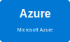

# Multi-Cloud Auto Deploy Platform


[](https://github.com/PLAYER1-r7/multicloud-auto-deploy/actions/workflows/deploy-aws.yml)
[](https://github.com/PLAYER1-r7/multicloud-auto-deploy/actions/workflows/deploy-azure.yml)
[](https://github.com/PLAYER1-r7/multicloud-auto-deploy/actions/workflows/deploy-gcp.yml)

**マルチクラウド対応の自動デプロイシステム** - AWS/Azure/GCP対応のフルスタックアプリケーション自動デプロイプラットフォーム

## 🌐 Supported Cloud Providers

<p align="center">
  
  
  
</p>

## 🌐 Live Demos

### 本番環境（Pulumi管理）✅ 2026-02-27 セキュリティ本番反映完了

| Cloud Provider            | API Endpoint                                                                                                    | Frontend (CDN)                                                                   | Direct Storage                                                                                                |
| ------------------------- | --------------------------------------------------------------------------------------------------------------- | -------------------------------------------------------------------------------- | ------------------------------------------------------------------------------------------------------------- |
| **AWS** (ap-northeast-1)  | [API Gateway](https://qkzypr32af.execute-api.ap-northeast-1.amazonaws.com)                                      | [CloudFront](https://d1qob7569mn5nw.cloudfront.net) ✅                           | [S3 Static](http://multicloud-auto-deploy-production-frontend.s3-website-ap-northeast-1.amazonaws.com)        |
| **Azure** (japaneast)     | [Functions](https://multicloud-auto-deploy-production-func-d8a2guhfere0etcq.japaneast-01.azurewebsites.net/api) | [Front Door](https://mcad-production-diev0w-f9ekdmehb0bga5aw.z01.azurefd.net) ✅ | [Blob Storage](https://mcadwebdiev0w.z11.web.core.windows.net)                                                |
| **GCP** (asia-northeast1) | [Cloud Functions](https://multicloud-auto-deploy-production-api-***-an.a.run.app)                               | [Cloud CDN](https://www.gcp.ashnova.jp) ✅                                       | [Cloud Storage](https://storage.googleapis.com/ashnova-multicloud-auto-deploy-production-frontend/index.html) |

### セキュリティ本番反映（2026-02-27） 🔐

| Cloud Provider | Resource              | セキュリティ実装                               | 状態        |
| -------------- | --------------------- | ---------------------------------------------- | ----------- |
| **AWS**        | CloudFront + Lambda   | CORS 絞り込み + CloudTrail                     | ✅ 本番反映 |
| **Azure**      | Key Vault + Functions | Purge Protection + Managed Identity + 診断ログ | ✅ 本番反映 |
| **GCP**        | Cloud Functions       | HTTPS redirect + Audit Logs + Cloud Armor      | ✅ 本番反映 |

> 🌐 **全クラウドでCDN配信を実装！** CloudFront, Front Door, Cloud CDNによる高速・安全なコンテンツ配信
>
> 🛠️ **Infrastructure as Code**: Pulumiで全CDNリソースを管理（詳細: [CDNセットアップガイド](docs/CDN_SETUP.md)）
>
> 📋 詳細情報: [エンドポイント一覧](docs/ENDPOINTS.md)
>
> 📝 **2026-02-27 更新**: S1 セキュリティ全本番反映完了 / S2 Managed Identity 有効化 / Task 20/21 Key Vault & Defender 実装済み
>
> 📝 **2026-02-22 Refactoring**: [Infra & CI/CD Refactoring Report](docs/REFACTORING_REPORT_20260222.md) — Azure AFD SPA fix, workflow cleanup, Pulumi dead code removal, staging validation

## 🚀 特徴

- **マルチクラウド対応**: AWS、Azure、GCPに対応
- **フルスタック**: フロントエンド、バックエンド、データベースの完全なスタック
- **自動デプロイ**: GitHub Actionsによる完全自動化
- **IaC統合**: Pulumi 3.0+による Infrastructure as Code
- **完全Python版**: Pulumi + FastAPI + Reflexによる統一スタック
- **CI/CD**: プッシュやPRで自動的にビルド・デプロイ
- **簡単セットアップ**: スクリプト一つで環境構築

## 📁 プロジェクト構造

```
multicloud-auto-deploy/
├── .github/workflows/     # GitHub Actionsワークフロー
├── infrastructure/        # インフラストラクチャコード
│   └── pulumi/           # Pulumiコード（Python - AWS/Azure/GCP）
├── services/             # アプリケーションコード
│   ├── api/              # FastAPI バックエンド（Python 3.12）
│   ├── frontend_react/   # React フロントエンド（Vite + TypeScript）
│   └── frontend_reflex/  # Reflex フロントエンド（実験的）
├── scripts/              # デプロイ・テストスクリプト
├── docs/                 # ドキュメント
│   ├── CDN_SETUP.md                      # CDN設定ガイド
│   ├── ENDPOINTS.md                      # エンドポイント一覧
│   └── REFACTORING_REPORT_20260222.md    # 🆕 Infra & CI/CD refactoring report (2026-02-22)
└── static-site/          # 静的サイト（環境選択画面）
```

## 🛠️ セットアップ

### 前提条件

- Python 3.12+
- Docker & Docker Compose
- Pulumi 3.0+
- AWS CLI 2.x / Azure CLI 2.x / gcloud CLI 556.0+
- GitHub アカウント

### 技術スタック

**Frontend**

- **Framework**: React 18+ (Vite)
- **Hosting**: Static Site (S3 / Azure Blob / Cloud Storage)
- **CDN**: CloudFront / Azure Front Door / Cloud CDN
- **Build**: Vite 7.3+, TypeScript

**Backend**

- **Framework**: FastAPI 1.0+ (Python 3.12)
- **AWS**: Lambda (x86_64) + API Gateway v2 (HTTP)
- **Azure**: Azure Functions (Python)
- **GCP**: Cloud Functions (Python 3.11)

**Database**

- **AWS**: DynamoDB (PAY_PER_REQUEST)
- **Azure**: Cosmos DB (Serverless)
- **GCP**: Firestore (Native Mode)

**Infrastructure**

- **IaC**: Pulumi 3.0+
  - Infrastructure as Code管理（`infrastructure/pulumi/`）
    - AWS: Lambda + API Gateway
    - Azure: Functions + Cosmos DB
    - GCP: Cloud Functions
- **CI/CD**: GitHub Actions

**CI/CD**

- GitHub Actions
- Automated builds and deployments
- Docker-based deployments
- S3-based Lambda deployment

### クイックスタート

#### 🐍 Python Full Stack版（推奨）

1. **リポジトリをクローン**

```bash
git clone https://github.com/PLAYER1-r7/multicloud-auto-deploy.git
cd multicloud-auto-deploy
```

2. **ローカル開発環境起動**

```bash
# バックエンド（FastAPI）
docker-compose up -d api

# フロントエンド（React）
cd services/frontend_react
npm install
npm run dev

# アクセス先:
# - React Frontend: http://localhost:5173
# - FastAPI API Docs: http://localhost:8000/docs
```

3. **Pulumiでデプロイ**

```bash
# AWS例
cd infrastructure/pulumi/aws/simple-sns
pip install -r requirements.txt
pulumi stack init staging
pulumi config set aws:region ap-northeast-1
pulumi up
```

> 📚 詳細な移行ガイドは [docs/PYTHON_MIGRATION.md](docs/PYTHON_MIGRATION.md) を参照

### クイックスタート

1. **リポジトリをクローン**

```bash
git clone https://github.com/PLAYER1-r7/multicloud-auto-deploy.git
cd multicloud-auto-deploy
```

2. **GitHub Secretsを設定**

```bash
./scripts/setup-github-secrets.sh
```

3. **コードをプッシュして自動デプロイ**

```bash
git push origin main
# GitHub Actionsが自動的にデプロイを実行
```

## 📚 ドキュメント

### 必読ガイド

- 📖 [セットアップガイド](docs/SETUP.md) - 初期セットアップ手順
- 🚀 [CI/CD設定](docs/CICD_SETUP.md) - GitHub Actions自動デプロイ設定
- ✅ [CI/CDテスト結果](docs/CICD_TEST_RESULTS.md) - パイプライン検証レポート
- 🔧 [トラブルシューティング](docs/TROUBLESHOOTING.md) - よくある問題と解決策
- 🌐 [エンドポイント一覧](docs/ENDPOINTS.md) - 全環境のエンドポイント情報
- 🌍 [CDNセットアップガイド](docs/CDN_SETUP.md) - CloudFront/Front Door/Cloud CDN設定
- 📦 [関数サイズ最適化](docs/FUNCTION_SIZE_OPTIMIZATION.md) - デプロイパッケージサイズ削減（AWS 97%削減！）
- 📝 [クイックリファレンス](docs/QUICK_REFERENCE.md) - よく使うコマンド集
- 🔐 [セキュリティ実装](docs/AI_AGENT_08_SECURITY.md) - Key Vault / Managed Identity / WAF / CloudTrail / Audit Logs

### プロバイダー別デプロイ

- [AWS デプロイ](docs/AWS_DEPLOYMENT.md)
- [Azure デプロイ](docs/AZURE_DEPLOYMENT.md)
- [GCP デプロイ](docs/GCP_DEPLOYMENT.md)

### アーキテクチャ

- [システムアーキテクチャ](docs/ARCHITECTURE.md) - 完全版システム設計
- [クラウドアーキテクチャ可視化](docs/CLOUD_ARCHITECTURE_MAPPER.md) - 公式アイコン付きインタラクティブHTML図生成
  - 📊 [Staging環境](docs/generated/architecture/architecture.staging.html) - AWS/Azure/GCP公式アイコン統合版
  - 📊 [Production環境](docs/generated/architecture/architecture.production.html) - 本番環境構成図
  - 📊 [統合ビュー](docs/generated/architecture/architecture-combined.html) - Staging + Production比較図

## 🔄 GitHub Actions 自動デプロイ

プッシュやPRで自動的にビルド・デプロイが実行されます：

- `main`ブランチへのプッシュ → 全3クラウド本番デプロイ（AWS/Azure/GCP）
- `develop`ブランチへのプッシュ → ステージング環境へデプロイ
- PRの作成/更新 → ビルド検証
- 手動トリガー → 任意の環境へデプロイ

**2026-02-27 デプロイ状況**:

- ✅ AWS production: 9/0 SNS E2E test PASS
- ✅ Azure production: 17/0 SNS E2E test PASS
- ✅ GCP production: 13/0 SNS E2E test PASS
- ✅ 全環境セキュリティ実装完了（Pulumi反映）

### ワークフロー

| ワークフロー         | トリガー              | デプロイ先          | 説明                      |
| -------------------- | --------------------- | ------------------- | ------------------------- |
| **deploy-aws.yml**   | `main`へのpush / 手動 | AWS Lambda          | Lambda + API Gateway更新  |
| **deploy-azure.yml** | `main`へのpush / 手動 | Azure Functions     | Functions + Cosmos DB更新 |
| **deploy-gcp.yml**   | `main`へのpush / 手動 | GCP Cloud Functions | Cloud Functions更新       |

### 必要なGitHub Secrets

以下のシークレットを設定してください（詳細は [CI/CD設定ガイド](docs/CICD_SETUP.md) 参照）：

**Pulumi（必須）**

- `PULUMI_ACCESS_TOKEN` - Pulumi Cloud認証トークン（すべてのデプロイで必須）

**Azure Functions**

- `AZURE_CREDENTIALS` - Service Principal認証情報（JSON）
- `AZURE_SUBSCRIPTION_ID` - Azure Subscription ID
- `AZURE_RESOURCE_GROUP` - リソースグループ名

**GCP Cloud Functions**

- `GCP_CREDENTIALS` - サービスアカウントキー（JSON）
- `GCP_PROJECT_ID` - プロジェクトID

**AWS Lambda**

- `AWS_ACCESS_KEY_ID` - AWS認証キーID
- `AWS_SECRET_ACCESS_KEY` - AWS認証シークレットキー

### デプロイ状況

最新のデプロイ状況は[GitHub Actions](https://github.com/PLAYER1-r7/multicloud-auto-deploy/actions)で確認でき、[詳細タスク進捗](docs/AI_AGENT_09_TASKS.md)も公開中です。

**最新ステータス（2026-02-27）:**
| タイプ | 対象 | 状態 |
|------|------|------|
| インフラ整備 | AWS/Azure/GCP Pulumi本番 | ✅ デプロイ完了 |
| セキュリティ実装 | CORS / CloudTrail / Key Vault / Managed Identity / Audit Logs | ✅ 本番反映完了 |
| E2E テスト | 全クラウド SNS 統合テスト | ✅ 39/39 PASS |
| 認証 | AWS Cognito / Azure AD / Firebase | ✅ 全完了 |
| CDN | CloudFront / Front Door / Cloud CDN | ✅ 全完了 |

### 手動デプロイ

GitHub Actionsページから手動でワークフローを実行：

```bash
# GitHub上で
Actions > Deploy to Multi-Cloud > Run workflow

# オプション:
- environment: staging / production
- deploy_target: all / azure / gcp
```

## 🏗️ サポートされるアーキテクチャ

### AWS (ap-northeast-1) ✅ 運用中

- **Frontend**: S3 Static Website Hosting
- **Backend**: Lambda (Python 3.12) + API Gateway v2
- **Database**: DynamoDB (PAY_PER_REQUEST)
- **Infrastructure**: Pulumi 3.0+
- **Deployment**: GitHub Actions

### Azure (japaneast) ✅ 運用中

- **Frontend**: Blob Storage ($web) + Azure Front Door
- **Backend**: Azure Functions (Python 3.12)
- **Database**: Cosmos DB (Serverless)
- **Infrastructure**: Pulumi 3.0+
- **Deployment**: GitHub Actions
- **CDN**: Azure Front Door (Standard)

### GCP (asia-northeast1) ✅ 運用中

- **Frontend**: Cloud Storage Static Website
- **Backend**: Cloud Functions (Python 3.12)
- **Database**: Firestore (Native Mode)
- **Infrastructure**: Pulumi 3.0+
- **Deployment**: GitHub Actions

## 🛠️ 開発ツール

### 便利なスクリプト

プロジェクトには以下の便利なスクリプトが含まれています：

```bash
# エンドポイントテスト（全環境）
./scripts/test-endpoints.sh

# E2Eテスト（全環境CRUD動作検証）
./scripts/test-e2e.sh

# GitHub Secrets設定ガイド
./scripts/manage-github-secrets.sh

# システム診断
./scripts/diagnostics.sh

# デプロイスクリプト
./scripts/deploy-aws.sh
./scripts/deploy-azure.sh
./scripts/deploy-gcp.sh
```

### Makefile

```bash
make install         # 依存関係をインストール
make build-frontend  # フロントエンドをビルド
make build-backend   # Lambda パッケージを作成
make test-all        # 全クラウドのデプロイメントをテスト
make deploy-aws      # AWSへデプロイ
make pulumi-preview  # Pulumi変更プレビュー
make pulumi-up       # Pulumiスタック適用
make clean           # ビルド成果物を削除
```

### Dev Container

VS Codeの Dev Containerに対応しています：

```bash
# 必要なツールが全てプリインストール
- Pulumi 3.x
- Node.js 18
- Python 3.12
- AWS CLI, Azure CLI, gcloud CLI
- Docker in Docker

# 便利なエイリアス
pulumi          # Pulumi CLI
deploy-aws      # AWS環境にデプロイ
deploy-azure    # Azure環境にデプロイ
deploy-gcp      # GCP環境にデプロイ
test-all        # 全エンドポイントテスト
```

### 診断スクリプト

システムの健全性をチェック：

```bash
./scripts/diagnostics.sh
```

- ✅ インストール済みツールの確認
- ✅ クラウドプロバイダー認証状態
- ✅ デプロイメントエンドポイントのテスト
- ✅ Pulumiスタック状態の確認

## 🧪 テストとデバッグ

### エンドポイントテスト

```bash
# すべてのクラウドプロバイダーをテスト
./scripts/test-endpoints.sh

# 個別テスト
curl https://52z731x570.execute-api.ap-northeast-1.amazonaws.com/
curl https://mcad-staging-api--0000004.livelycoast-fa9d3350.japaneast.azurecontainerapps.io/
curl https://mcad-staging-api-son5b3ml7a-an.a.run.app/
```

### ローカル開発

```bash
# フロントエンド
cd services/frontend
npm install
npm run dev

# バックエンド（Python）
cd services/backend
pip install -r requirements.txt
uvicorn src.main:app --reload
```

## 🛠️ デプロイツール

### Lambda デプロイスクリプト

Lambda + API Gatewayの完全自動デプロイメント:

```bash
# AWS Lambda デプロイ
cd scripts
./deploy-lambda-aws.sh

# 環境変数でカスタマイズ可能
PROJECT_NAME=myproject ENVIRONMENT=production ./deploy-lambda-aws.sh
```

スクリプトは以下を自動実行します：

- 依存関係のインストール（manylinux2014_x86_64）
- ZIPパッケージ作成とS3アップロード
- Lambda関数の作成/更新
- API Gateway統合設定
- Lambda権限設定（HTTP API用の正しいSourceArn）
- CloudWatch Logsアクセスログ有効化

### API統合テスト

エンドポイントの完全なCRUDテスト:

```bash
# テスト実行
./scripts/test-api.sh -e https://YOUR_API_ID.execute-api.ap-northeast-1.amazonaws.com

# 詳細モード
./scripts/test-api.sh -e https://YOUR_API_ID.execute-api.ap-northeast-1.amazonaws.com --verbose
```

テスト項目：

- ヘルスチェック
- メッセージCRUD操作（作成、取得、更新、削除）
- ページネーション
- エラーハンドリング
- バリデーション

### E2EテストスイートとセキュリティフローE2E

全環境（AWS/GCP/Azure）のエンドツーエンドCRUD動作を検証:

```bash
# SNS/Messaging E2Eテスト（全環境統合）
./scripts/test-sns-all.sh

# 個別クラウドテスト
./scripts/test-sns-aws.sh
./scripts/test-sns-azure.sh
./scripts/test-sns-gcp.sh
```

**テストカバレッジ（2026-02-27 実績）**:

- **AWS**: 9 PASS / 0 FAIL
- **Azure**: 17 PASS / 0 FAIL
- **GCP**: 13 PASS / 0 FAIL
- **Total**: 39 PASS / 0 FAIL ✅

**テスト項目**:

- ✅ Health Checks: 各環境のヘルスエンドポイント検証
- ✅ CRUD Operations: Create/List/Get/Update/Delete
- ✅ Authentication: Cloud-native認証（Cognito/Azure AD/Firebase）
- ✅ Image Upload: PUT /posts with images（AWS S3/Azure Blob/GCP GCS）
- ✅ Error Handling: 404/403/500エラー処理検証

**クラウド固有のパス処理**:

- AWS/GCP: `/api/messages/`
- Azure: `/api/HttpTrigger/api/messages/`（Flex Consumption対応）

**期待される出力例**:

```
═══════════════════════════════════════════════════════
        Multi-Cloud E2E Test Suite
═══════════════════════════════════════════════════════

━━━━━━━━━━━━━━━━━━━━━━━━━━━━━━━━━━━━━━━━━━━━━━━━━━━
  Testing: AWS
━━━━━━━━━━━━━━━━━━━━━━━━━━━━━━━━━━━━━━━━━━━━━━━━━━━
✓ Health check returned 'ok'
✓ Create message (ID: abc123...)
✓ List messages (found 5)
✓ Get message by ID
✓ Update message
✓ Delete message

[GCP/Azure: 同様]

═══════════════════════════════════════════════════════
        Test Summary
═══════════════════════════════════════════════════════
Total Tests:  18
Passed:       18
All tests passed! ✓
```

**データ永続性検証**:

- AWS: DynamoDB (PAY_PER_REQUEST)
- GCP: Firestore (Native Mode)
- Azure: Cosmos DB (Serverless)

### CloudWatch監視設定

包括的な監視とアラートを自動設定:

```bash
# 監視設定
./scripts/setup-monitoring.sh

# メール通知付き
ALERT_EMAIL=your@email.com ./scripts/setup-monitoring.sh
```

設定内容：

- SNSトピックとメール通知
- Lambda エラー/スロットリング/実行時間/同時実行数アラーム
- API Gateway 5XXエラー/レイテンシアラーム
- DynamoDB スロットリングアラーム
- CloudWatch Logs メトリクスフィルター
- CloudWatch ダッシュボード自動作成

### 推奨: 追加すべきAWSサービス

本番運用のために以下のサービス追加を推奨します:

#### 1. AWS X-Ray（分散トレーシング）

Lambda関数のトレーシング有効化:

```bash
aws lambda update-function-configuration \
  --function-name YOUR_FUNCTION_NAME \
  --tracing-config Mode=Active
```

FastAPIにX-Ray統合:

```python
# requirements.txtに追加
aws-xray-sdk==2.12.0

# main.pyで有効化
from aws_xray_sdk.core import xray_recorder
from aws_xray_sdk.ext.fastapi.middleware import XRayMiddleware

app.add_middleware(XRayMiddleware, recorder=xray_recorder)
```

#### 2. AWS WAF（セキュリティ）

API Gatewayへの攻撃防御:

```bash
# WAF Web ACL作成
aws wafv2 create-web-acl \
  --name multicloud-auto-deploy-waf \
  --scope REGIONAL \
  --default-action Allow={} \
  --rules file://waf-rules.json

# API Gatewayに関連付け
aws wafv2 associate-web-acl \
  --web-acl-arn YOUR_WEB_ACL_ARN \
  --resource-arn YOUR_API_GATEWAY_ARN
```

#### 3. Route 53 + カスタムドメイン

プロダクション用ドメイン設定:

```bash
# ACM証明書作成
aws acm request-certificate \
  --domain-name api.yourdomain.com \
  --validation-method DNS

# API Gatewayカスタムドメイン
aws apigatewayv2 create-domain-name \
  --domain-name api.yourdomain.com \
  --domain-name-configurations CertificateArn=YOUR_CERT_ARN

# Route 53レコード作成
aws route53 change-resource-record-sets \
  --hosted-zone-id YOUR_ZONE_ID \
  --change-batch file://route53-changes.json
```

#### 4. Parameter Store / Secrets Manager

環境変数の安全な管理:

```bash
# Secrets Managerに保存
aws secretsmanager create-secret \
  --name multicloud-auto-deploy/staging/db-config \
  --secret-string '{"host":"dynamodb","region":"ap-northeast-1"}'

# Lambda関数で使用
# requirements.txtに追加: boto3
```

```python
import boto3
import json

def get_secret():
    client = boto3.client('secretsmanager')
    response = client.get_secret_value(SecretId='multicloud-auto-deploy/staging/db-config')
    return json.loads(response['SecretString'])
```

#### 5. Lambda Layers（依存関係最適化）

共通ライブラリの分離でコールドスタート改善:

```bash
# Lambda Layer作成
mkdir python
pip install -r requirements.txt -t python/
zip -r layer.zip python/

aws lambda publish-layer-version \
  --layer-name multicloud-auto-deploy-dependencies \
  --zip-file fileb://layer.zip \
  --compatible-runtimes python3.12

# Lambda関数に紐付け
aws lambda update-function-configuration \
  --function-name YOUR_FUNCTION_NAME \
  --layers YOUR_LAYER_ARN
```

#### 6. CloudFront Functions（エッジ処理）

リクエスト/レスポンスのエッジ処理:

```javascript
// CloudFront Function: セキュリティヘッダ追加
function handler(event) {
  var response = event.response;
  response.headers["strict-transport-security"] = {
    value: "max-age=31536000; includeSubdomains",
  };
  response.headers["x-content-type-options"] = { value: "nosniff" };
  response.headers["x-frame-options"] = { value: "DENY" };
  return response;
}
```

#### 7. AWS Backup（データ保護）

DynamoDBの自動バックアップ:

```bash
aws backup create-backup-plan \
  --backup-plan file://backup-plan.json

aws backup create-backup-selection \
  --backup-plan-id YOUR_PLAN_ID \
  --backup-selection file://backup-selection.json
```

### トラブルシューティング

問題が発生した場合は [トラブルシューティングガイド](docs/TROUBLESHOOTING.md) を参照してください：

- Azure認証問題（Service Principal、Pulumi Provider等）
- GCPリソース競合（State管理、リソースインポート）
- フロントエンドAPI接続問題（ビルド順序、API URL設定）
- 権限エラー（IAM、RBAC設定）

## 🤝 貢献

コントリビューションを歓迎します！詳細は [CONTRIBUTING.md](CONTRIBUTING.md) をご覧ください。

## 📄 ライセンス

MIT License - 詳細は [LICENSE](LICENSE) をご覧ください。

## 🔗 関連リンク

- [GitHub Actions Documentation](https://docs.github.com/en/actions)
- [Terraform Documentation](https://www.terraform.io/docs)
- [Pulumi Documentation](https://www.pulumi.com/docs/)
