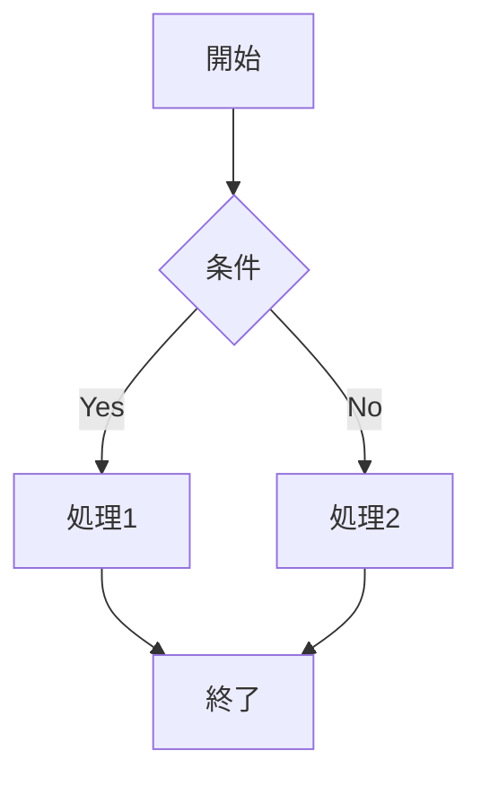
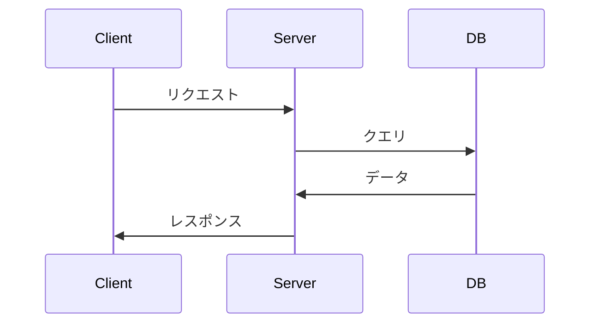

# Markdown記法ガイド

このSNSでは、投稿にMarkdown記法を使用できます。Markdownを使うと、見やすく構造化された文章を簡単に作成できます。

## 基本記法

### 見出し

```markdown
# 見出し1（最大）

## 見出し2

### 見出し3

#### 見出し4

##### 見出し5

###### 見出し6（最小）
```

### 強調・装飾

```markdown
**太字**
_イタリック_
**_太字＋イタリック_**
~~打消し線~~
```

**太字**  
_イタリック_  
**_太字＋イタリック_**  
~~打消し線~~

### リンク

```markdown
[リンクテキスト](https://example.com)
<https://example.com>
```

[リンクテキスト](https://example.com)

### 画像

```markdown

```

### リスト

**番号なしリスト**

```markdown
- 項目1
- 項目2
  - サブ項目2-1
  - サブ項目2-2
- 項目3
```

- 項目1
- 項目2
  - サブ項目2-1
  - サブ項目2-2
- 項目3

**番号付きリスト**

```markdown
1. 項目1
2. 項目2
3. 項目3
```

1. 項目1
2. 項目2
3. 項目3

**タスクリスト**

```markdown
- [ ] 未完了タスク
- [x] 完了タスク
```

- [ ] 未完了タスク
- [x] 完了タスク

### 引用

```markdown
> 引用文
> 複数行にわたる
> 引用もできます
```

> 引用文  
> 複数行にわたる  
> 引用もできます

### コード

**インラインコード**

```markdown
`console.log('Hello')`
```

`console.log('Hello')`

**コードブロック**

````markdown
```javascript
function hello() {
  console.log("Hello, World!");
}
```
````

```javascript
function hello() {
  console.log("Hello, World!");
}
```

**ファイル名付きコードブロック**

````markdown
```javascript:app.js
const app = express();
app.listen(3000);
```
````

### テーブル

```markdown
| 列1     |   列2   |     列3 |
| ------- | :-----: | ------: |
| 左寄せ  |  中央   |  右寄せ |
| データ1 | データ2 | データ3 |
```

| 列1     |   列2   |     列3 |
| ------- | :-----: | ------: |
| 左寄せ  |  中央   |  右寄せ |
| データ1 | データ2 | データ3 |

### 水平線

```markdown
---

---

---
```

---

## 拡張記法

### 情報ボックス（Qiita記法）

```markdown
:::note info
ℹ️ 情報を表示します
:::

:::note warn
⚠️ 警告を表示します
:::

:::note alert
🚨 アラートを表示します
:::
```

:::note info
ℹ️ 情報を表示します
:::

:::note warn
⚠️ 警告を表示します
:::

:::note alert
🚨 アラートを表示します
:::

### Mermaid図

````markdown

````


**フローチャート**


**シーケンス図**



### 数式（KaTeX）

**インライン数式**

```markdown
$E = mc^2$
```

$E = mc^2$

**ブロック数式**

```markdown
$$
\int_{-\infty}^{\infty} e^{-x^2} dx = \sqrt{\pi}
$$
```

$$
\int_{-\infty}^{\infty} e^{-x^2} dx = \sqrt{\pi}
$$

## Tips

### 改行

通常の改行は無視されます。改行するには：

- 行末に半角スペース2つ
- 空行を入れる

### エスケープ

Markdown記号をそのまま表示したい場合は `\` でエスケープ：

```markdown
\*これは強調されません\*
```

\*これは強調されません\*

### コメント

```markdown
<!-- このコメントは表示されません -->
```

<!-- このコメントは表示されません -->

---

詳しい情報は [とほほのMarkdown入門](https://www.tohoho-web.com/ex/markdown.html) をご覧ください。
