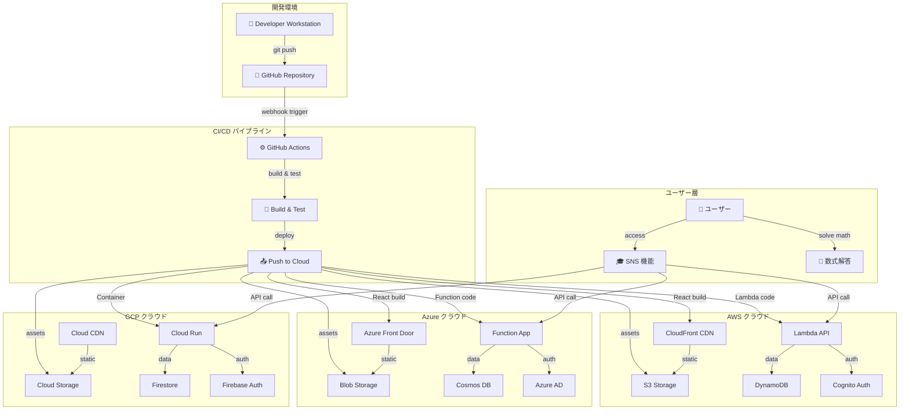
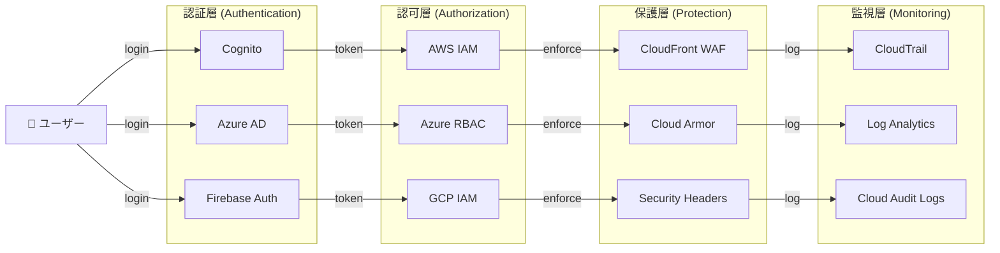
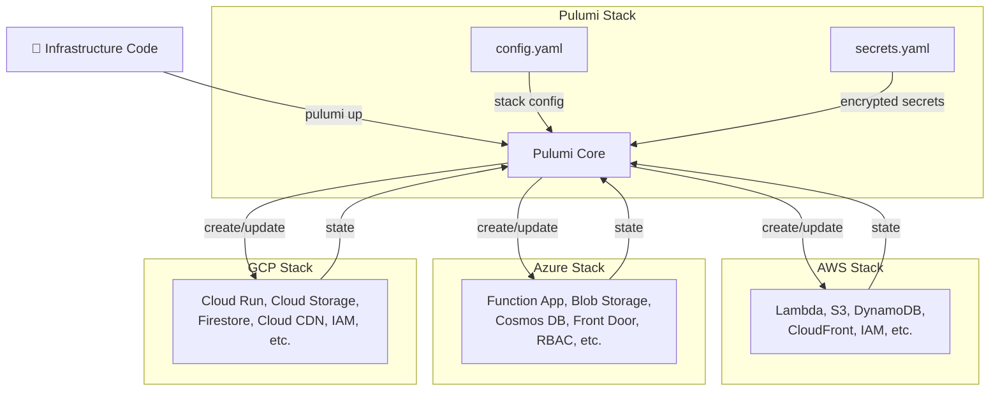
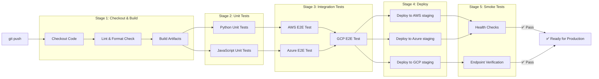
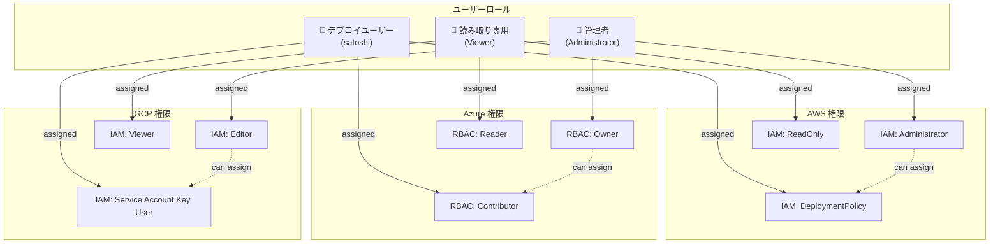
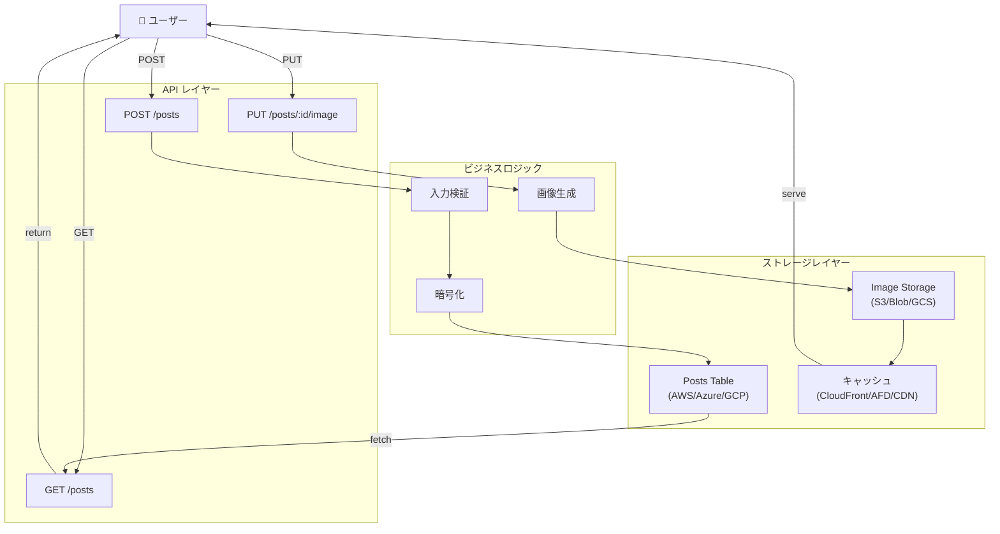
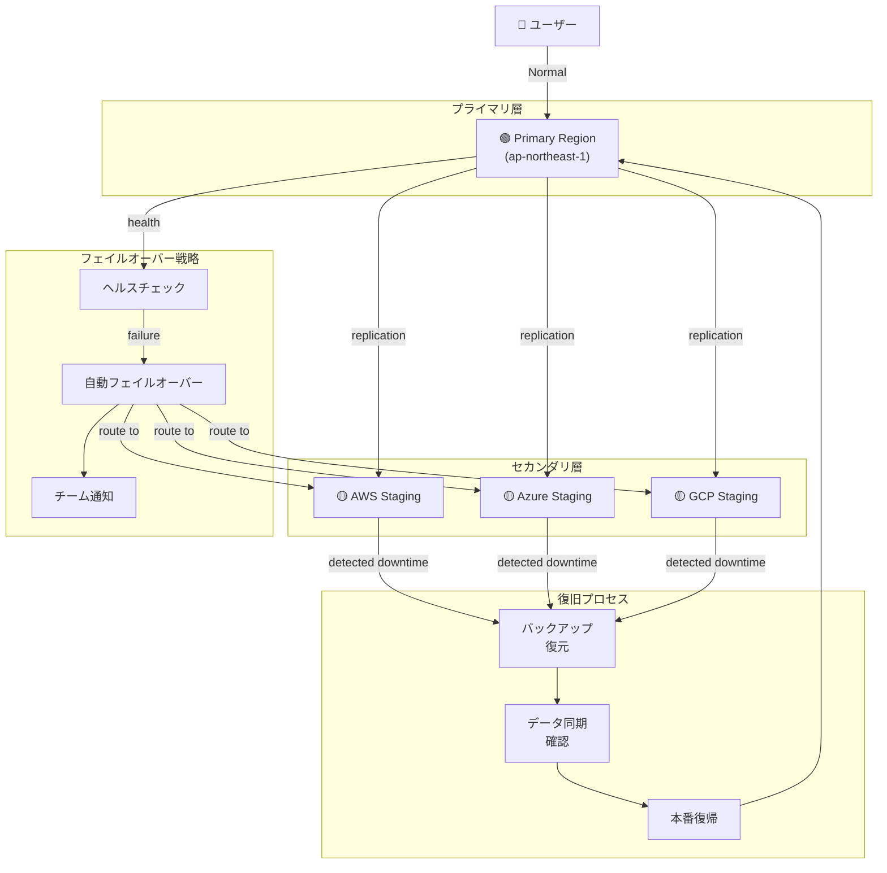

# アーキテクチャダイアグラム

> マルチクラウド自動デプロイシステム全体の構造と関係図

---

## 1. 全体アーキテクチャフロー

デプロイから運用までの全体的なデータフローと責任分岐を示します。

---

## 2. セキュリティレイヤー

認証・認可・監視の多層防御を示します。

---

## 3. デプロイ戦略（Pulumi Infrastructure as Code）

Pulumi を使用した 3 クラウドへの統一デプロイメント構造。

---

## 4. CI/CD パイプラインステージ

GitHub Actions による自動テストと段階的デプロイ。

---

## 5. 権限とロール分離（IAM/RBAC）

最小権限の法則に基づいた権限構造。

---

## 6. データモデルと API フロー

SNS 投稿の生成から取得・画像処理までのデータフロー。

---

## 7. インシデント対応フロー

本番環境のトラブルシューティングとロールバック手順。

```mermaid
graph LR
    INCIDENT["🚨 インシデント<br/>検出"]

    subgraph "検出フェーズ"
        MONITOR["モニタリング<br/>(CloudWatch/Monitor/Logging)"]
        ALERT["アラート<br/>通知"]
    end

    subgraph "調査フェーズ"
        LOGS["ログ分析"]
        TRACE["分散トレース"]
        ROOT_CAUSE["根本原因<br/>特定"]
    end

    subgraph "対応フェーズ"
        DECIDE{修正方法<br/>の選択}
        HOTFIX["ホットフィックス<br/>デプロイ"]
        ROLLBACK["ロールバック<br/>実行"]
    end

    subgraph "検証フェーズ"
        SMOKE_TEST["スモークテスト"]
        HEALTH_CHECK["ヘルスチェック"]
        VERIFY["機能検証"]
    end

    subgraph "事後処理"
        POSTMORTEM["ポストモーテム<br/>作成"]
        DOCS["ドキュメント<br/>更新"]
        MONITORING["監視ルール<br/>強化"]
    end

    INCIDENT --> MONITOR
    MONITOR --> ALERT
    ALERT --> LOGS
    LOGS --> TRACE
    TRACE --> ROOT_CAUSE

    ROOT_CAUSE --> DECIDE
    DECIDE -->|軽微な修正| HOTFIX
    DECIDE -->|重大な問題| ROLLBACK

    HOTFIX --> SMOKE_TEST
    ROLLBACK --> SMOKE_TEST
    SMOKE_TEST --> HEALTH_CHECK
    HEALTH_CHECK --> VERIFY

    VERIFY -->|✅ OK| POSTMORTEM
    POSTMORTEM --> DOCS
    DOCS --> MONITORING
```

---

## 8. マルチクラウド冗長性戦略

3 つのクラウドプロバイダーにおける同時運用と災害復旧。

---

## 参照

- [AI_AGENT_02_ARCHITECTURE.md](AI_AGENT_02_ARCHITECTURE.md) — 詳細アーキテクチャ
- [AI_AGENT_04_INFRA.md](AI_AGENT_04_INFRA.md) — インフラストラクチャ設定
- [AI_AGENT_05_CICD.md](AI_AGENT_05_CICD.md) — CI/CD パイプライン詳細
- [AI_AGENT_07_RUNBOOKS.md](AI_AGENT_07_RUNBOOKS.md) — 運用手順書
- [AI_AGENT_08_SECURITY.md](AI_AGENT_08_SECURITY.md) — セキュリティ設定
