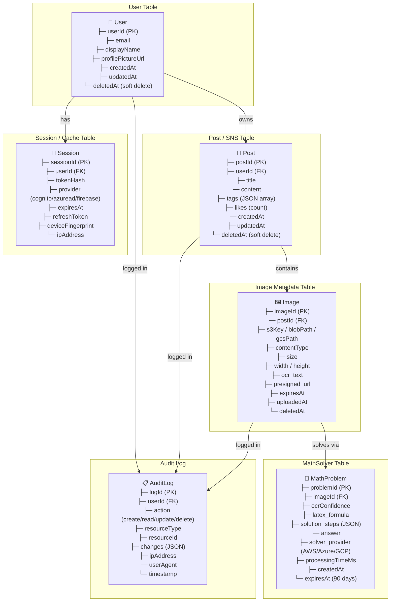
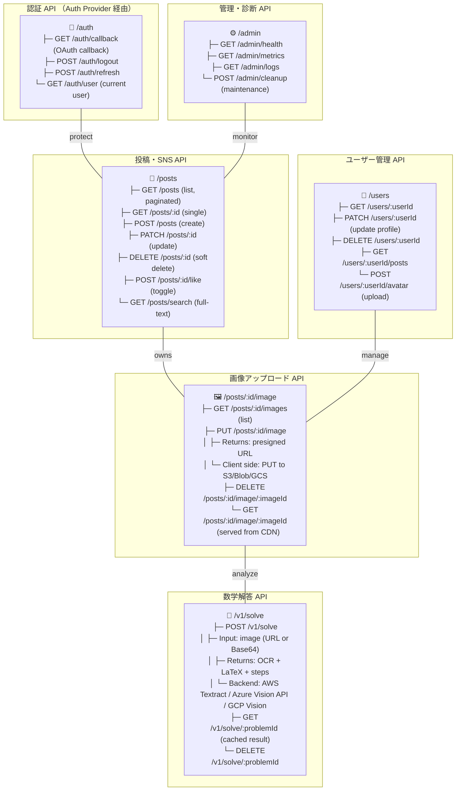
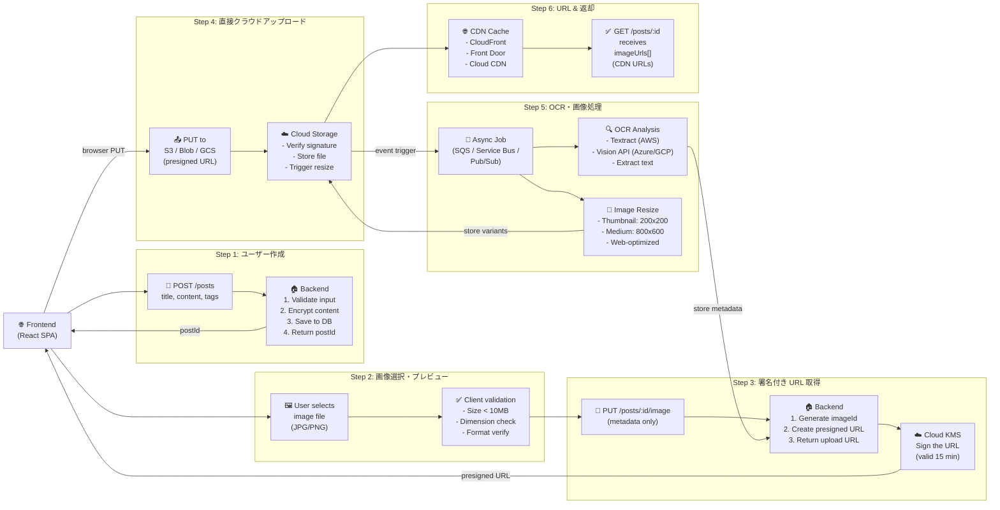
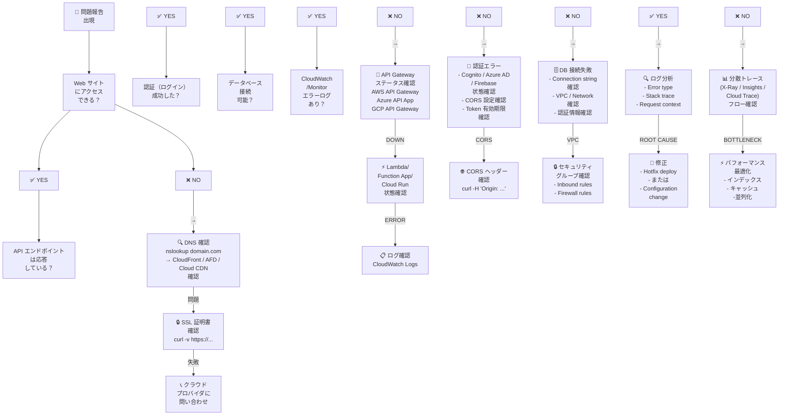
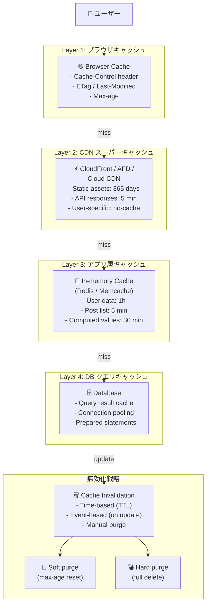
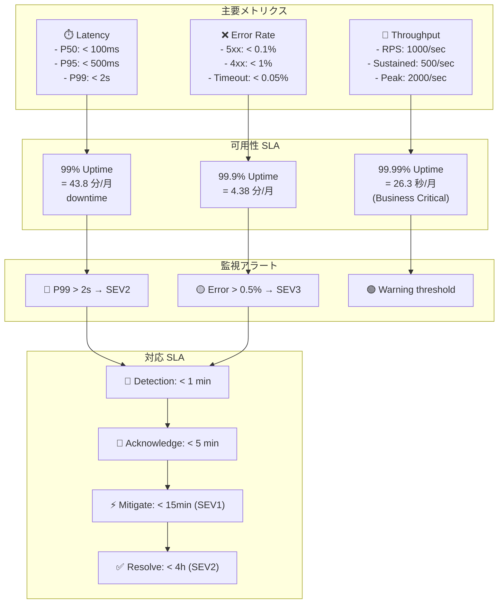
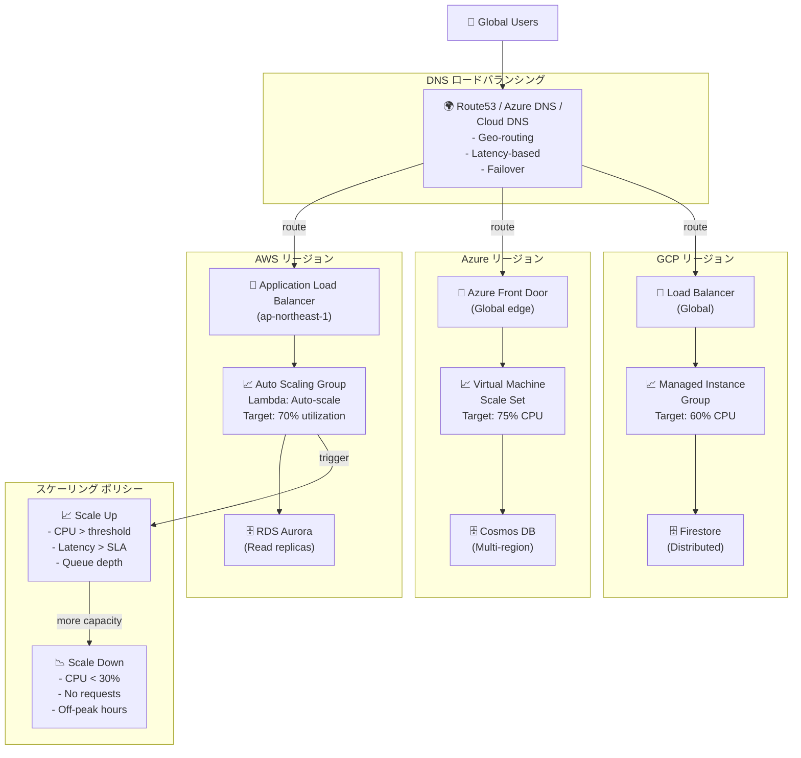

# データモデル・API・トラブルシューティングダイアグラム

> データベーススキーマ、API フロー、問題診断フローチャートを可視化

---

## 1. データベーススキーマ（3 クラウド共통）

マルチクラウド環境での データモデル設計。

---

## 2. API エンドポイントマップ

全 SNS・数式・認証 API の操作一覧。

---

## 3. POST・画像アップロード フロー

フロントエンドからサーバー、クラウドストレージへのデータフロー。

---

## 4. トラブルシューティング決定ツリー

エラー症状から原因特定・解決までの診断フロー。

---

## 5. キャッシュ戦略

CDN・DB キャッシュと無効化戦略。

---

## 6. エラーレート & SLA 監視

パフォーマンス指標と可用性 SLA。

---

## 7. ロードバランシング・スケーリング

マルチリージョン・マルチプロバイダへのトラフィック分散。

---

## 参照

- [AI_AGENT_03_API.md](AI_AGENT_03_API.md) — API 仕様詳細
- [AI_AGENT_12_OCR_MATH.md](AI_AGENT_12_OCR_MATH.md) — 数学解答 API
- [AI_AGENT_06_STATUS.md](AI_AGENT_06_STATUS.md) — 環境ステータス・トラブルシューティング
- [AI_AGENT_07_RUNBOOKS.md](AI_AGENT_07_RUNBOOKS.md) — 運用ハンドブック
