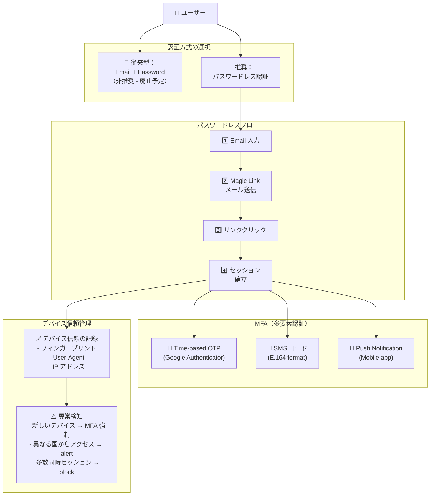
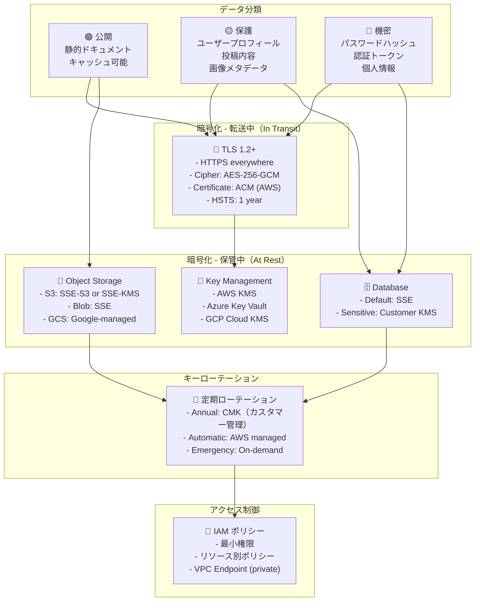
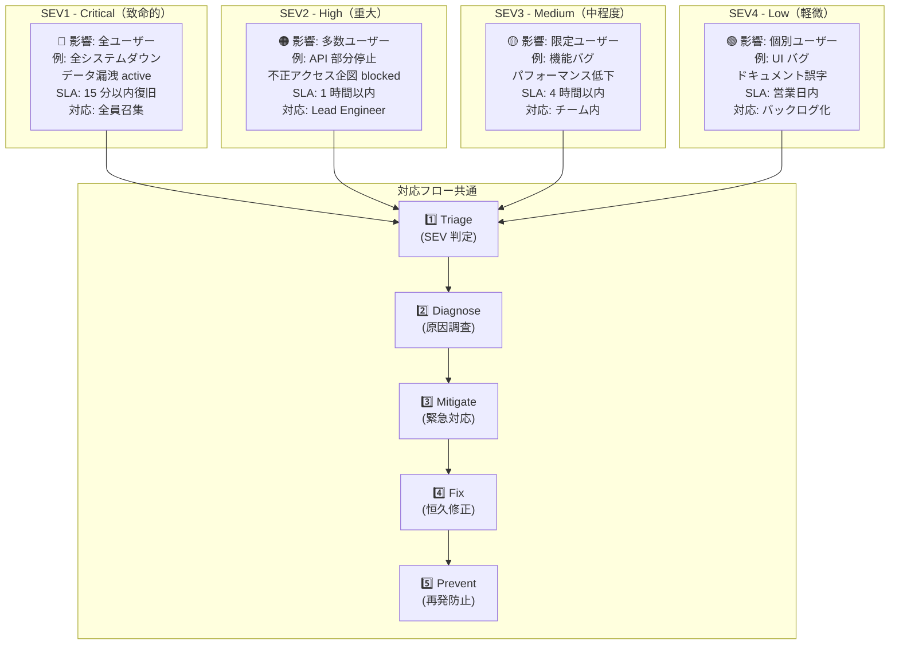
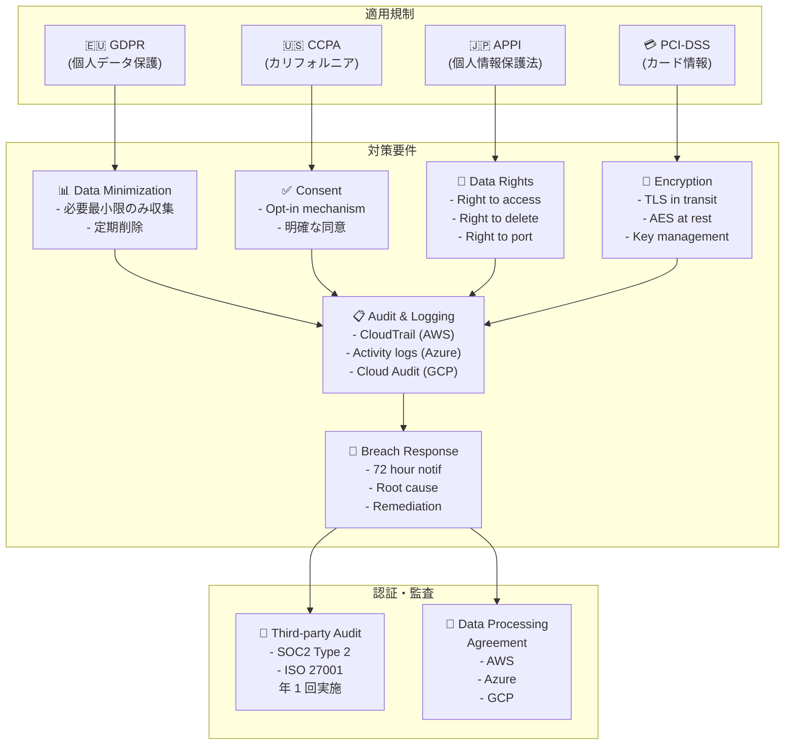

# セキュリティ・コンプライアンスダイアグラム

> マルチクラウド環境のセキュリティ体制、脅威モデル、コンプライアンス要件を可視化

---

## 1. セキュリティディフェンスレイヤー（Defense in Depth）

多層防御の構造。

```mermaid
graph TB
    USER["👤 ユーザー"]

    subgraph "レイヤー 1: ネットワークエッジ"
        DDoS["🛡️ DDoS Protection<br/>- AWS Shield<br/>- Azure DDoS Protection<br/>- Cloud Armor"]
        GEO["🌍 地域制限<br/>ブロック"]
    end

    subgraph "レイヤー 2: API ゲートウェイ"
        API_ENDPOINT["🚪 API Endpoint<br/>- CloudFront / AFD / CDN"]
        WAF["🔒 Web Application Firewall<br/>- AWS WAF<br/>- Cloud Armor<br/>- SQL インジェクション検知"]
        RATE_LIMIT["⏱️ Rate Limiting<br/>- 1000 req/min per IP<br/>- Token bucket algorithm"]
    end

    subgraph "レイヤー 3: 認証認可"
        AUTH["🔐 認証<br/>- OAuth2 + PKCE<br/>- AWS Cognito<br/>- Azure AD<br/>- Firebase Auth"]
        AUTHZ["🔑 認可・権限管理<br/>- IAM / RBAC<br/>- 最小権限の法則<br/>- セッション検証"]
    end

    subgraph "レイヤー 4: アプリケーション"
        INPUT["✅ 入力検証<br/>- SQL インジェクション対策<br/>- XSS 対策<br/>- CSRF 対策"]
        ENCRYPT["🔒 データ暗号化<br/>- TLS 1.2+<br/>- AES-256 at rest"]
        LOGGING["📝 ロギング<br/>- すべての API 呼び出し記録<br/>- 監査証跡"]
    end

    subgraph "レイヤー 5: データ保護"
        DB_ENC["🔐 DB 暗号化<br/>- AWS: SSE-S3<br/>- Azure: SSE<br/>- GCP: Google Cloud KMS"]
        BACKUP["💾 バックアップ<br/>- ポイントインタイムリカバリ<br/>- オフサイト複製"]
    end

    subgraph "レイヤー 6: 監視・検知"
        DETECT["🔍 脅威検知<br/>- Intrusion Detection<br/>- Anomaly Detection<br/>- Behavioral Analysis"]
        RESPOND["📢 インシデント対応<br/>- アラート<br/>- ロギング<br/>- 自動隔離"]
    end

    USER --> DDoS
    DDoS --> GEO
    GEO --> API_ENDPOINT
    API_ENDPOINT --> WAF
    WAF --> RATE_LIMIT

    RATE_LIMIT --> AUTH
    AUTH --> AUTHZ

    AUTHZ --> INPUT
    INPUT --> ENCRYPT
    ENCRYPT --> LOGGING

    LOGGING --> DB_ENC
    DB_ENC --> BACKUP

    BACKUP --> DETECT
    DETECT --> RESPOND
```



---

## 2. IAM 権限マトリックス（詳細版）

ユーザータイプ別の権限分布。

```mermaid
graph TB
    subgraph "ユーザーカテゴリ"
        ADMIN["👤 管理者<br/>(administrator)"]
        DEPLOY["👤 デプロイユーザー<br/>(satoshi)"]
        BACKEND["👤 バックエンド開発者"]
        FRONTEND["👤 フロントエンド開発者"]
        VIEWER["👤 読み取り専用<br/>(viewer)"]
    end

    subgraph "AWS IAM 権限"
        AWS_ADMIN["💼 AdministratorAccess<br/>- すべてのリソース操作"]
        AWS_DEPLOY["📦 DeploymentPolicy<br/>- Lambda 更新<br/>- S3 アップロード<br/>- CloudFront 無効化"]
        AWS_BACKEND["⚙️ Backend Developer<br/>- Lambda 関数ログ読み取り<br/>- DynamoDB クエリ<br/>- CloudWatch 表示"]
        AWS_FRONTEND["💻 Frontend Developer<br/>- S3 バケット読み取り<br/>- CloudFront キャッシュ"]
        AWS_READ["👀 ReadOnlyAccess"]
    end

    subgraph "Azure RBAC"
        AZURE_ADMIN["💼 Owner<br/>- すべてのリソース管理"]
        AZURE_DEPLOY["📦 Contributor<br/>- Function App 更新<br/>- リソース作成制限あり"]
        AZURE_BACKEND["⚙️ Function App<br/>Contributor"]
        AZURE_FRONTEND["💻 Blob Storage<br/>Data Contributor"]
        AZURE_READ["👀 Reader"]
    end

    subgraph "GCP IAM"
        GCP_ADMIN["💼 Editor<br/>- すべてのサービス管理"]
        GCP_DEPLOY["📦 Service Account<br/>Key User<br/>- Cloud Run Deploy"]
        GCP_BACKEND["⚙️ Cloud Run Developer"]
        GCP_FRONTEND["💻 Storage Object<br/>Viewer"]
        GCP_READ["👀 Viewer"]
    end

    ADMIN --> AWS_ADMIN
    ADMIN --> AZURE_ADMIN
    ADMIN --> GCP_ADMIN

    DEPLOY --> AWS_DEPLOY
    DEPLOY --> AZURE_DEPLOY
    DEPLOY --> GCP_DEPLOY

    BACKEND --> AWS_BACKEND
    BACKEND --> AZURE_BACKEND
    BACKEND --> GCP_BACKEND

    FRONTEND --> AWS_FRONTEND
    FRONTEND --> AZURE_FRONTEND
    FRONTEND --> GCP_FRONTEND

    VIEWER --> AWS_READ
    VIEWER --> AZURE_READ
    VIEWER --> GCP_READ
```



---

## 3. 認証フロー（OAuth2 + PKCE）

ユーザーログインと トークン取得の詳細なシーケンス。

```mermaid
graph LR
    CLIENT["🌐 SPA アプリ<br/>(ブラウザ)"]
    PROVIDER["🔐 ID Provider<br/>(Cognito / Azure AD /<br/>Firebase Auth)"]
    BACKEND["🏠 バックエンド API"]

    CLIENT -->|1. Generate<br/>code_verifier| CLIENT
    CLIENT -->|2. SHA256(verifier)<br/>→ code_challenge| CLIENT
    CLIENT -->|3. Redirect to<br/>/auth/authorize<br/>?challenge=...| PROVIDER

    PROVIDER -->|4. User login<br/>& consent| PROVIDER
    PROVIDER -->|5. Return<br/>authorization_code| CLIENT

    CLIENT -->|6. Exchange<br/>code + verifier<br/>for token| PROVIDER
    CLIENT -->|7. Validate<br/>verifier = SHA256<br/>of original| PROVIDER
    PROVIDER -->|8. Return<br/>access_token<br/>+ refresh_token| CLIENT

    CLIENT -->|9. Store in<br/>sessionStorage| CLIENT
    CLIENT -->|10. Call API<br/>with Bearer token| BACKEND
    BACKEND -->|11. Verify token<br/>signature & expiry| BACKEND
    BACKEND -->|12. Return<br/>protected resource| CLIENT

    BACKEND -->|13. Token expired?<br/>Use refresh_token| PROVIDER
    PROVIDER -->|14. Return new<br/>access_token| BACKEND
```

---

## 4. パスワードレス認証とデバイス信頼

多要素認証（MFA）とデバイス管理。



---

## 5. データ暗号化とキー管理

ステータ・イン・トランジット・アット・レストの暗号化戦略。



---

## 6. セキュリティインシデント分類と対応時間

インシデントの SEV（Severity）レベルと SLA。



---

## 7. OWASP Top 10 対策チェックリスト

Web セキュリティ脆弱性への対策実装状況。

```mermaid
graph TB
    subgraph "OWASP Top 10"
        A1["🟩 A1: Injection<br/>(SQL / NoSQL<br/>String interpolation)"]
        A2["🟩 A2: Broken Auth<br/>(Session fixation<br/>Weak password)"]
        A3["🟩 A3: Sensitive Data<br/>Exposure<br/>(Unencrypted transit)"]
        A4["🟩 A4: XML External Entities<br/>(XXE attacks)"]
        A5["🟩 A5: Broken Access<br/>Control<br/>(IDOR / Privilege<br/>escalation)"]
        A6["🟩 A6: Security Misconfiguration<br/>(Insecure defaults)"]
        A7["🟩 A7: XSS<br/>(DOM / Stored / Reflected)"]
        A8["🟩 A8: Insecure<br/>Deserialization<br/>(Pickle / JSON)"]
        A9["🟩 A9: Using<br/>Components with<br/>Known Vulns<br/>(Deps & SCA)"]
        A10["🟩 A10: Insufficient<br/>Logging & Monitoring<br/>(Audit trail)"]
    end

    subgraph "対策実装状況"
        IMPL1["✅ Parameterized queries"]
        IMPL2["✅ OAuth2 + PKCE"]
        IMPL3["✅ TLS 1.2+ + HSTS"]
        IMPL4["✅ XML parser sanitize"]
        IMPL5["✅ IAM + RBAC + CORS"]
        IMPL6["✅ Infrastructure as Code"]
        IMPL7["✅ CSP + DomPurify"]
        IMPL8["✅ JSON validation + type check"]
        IMPL9["✅ Dependabot + OWASP ZAP"]
        IMPL10["✅ CloudTrail + CloudWatch"]
    end

    A1 --> IMPL1
    A2 --> IMPL2
    A3 --> IMPL3
    A4 --> IMPL4
    A5 --> IMPL5
    A6 --> IMPL6
    A7 --> IMPL7
    A8 --> IMPL8
    A9 --> IMPL9
    A10 --> IMPL10
```



---

## 8. コンプライアンスフレームワーク

多クラウド環境での規制要件への対応。



---

## 参照

- [AI_AGENT_08_SECURITY.md](AI_AGENT_08_SECURITY.md) — セキュリティ設定詳細
- [AI_AGENT_00_CRITICAL_RULES.md](AI_AGENT_00_CRITICAL_RULES.md) — セキュリティルール
- [AI_AGENT_11_BUG_FIX_REPORTS.md](AI_AGENT_11_BUG_FIX_REPORTS.md) — 過去のセキュリティ修正
