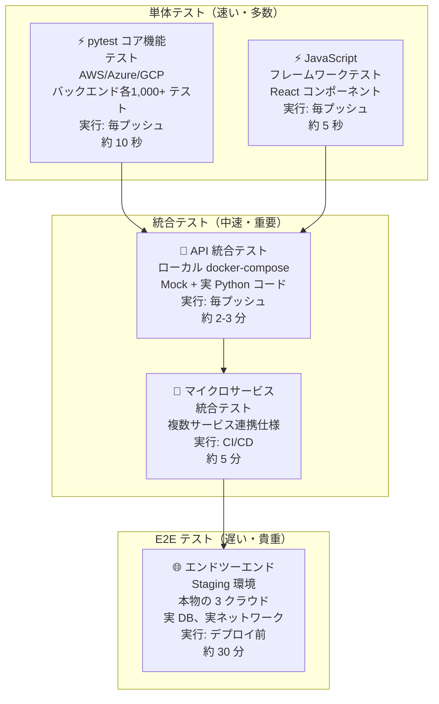
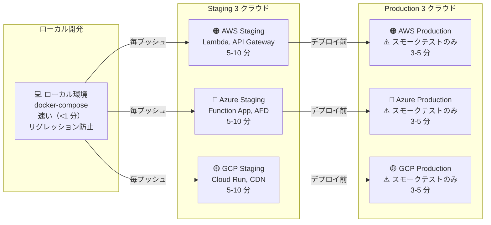
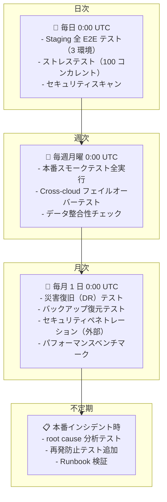
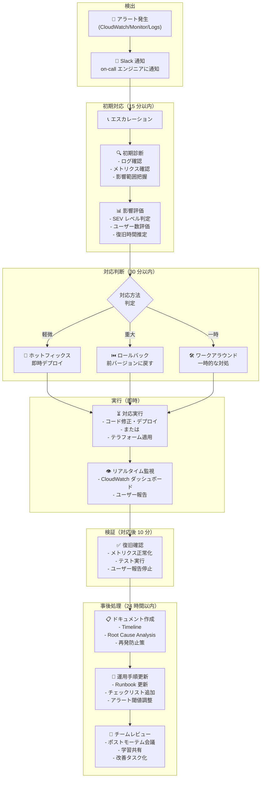
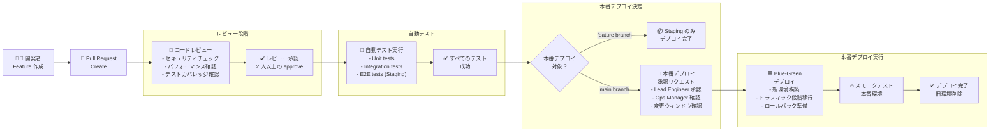
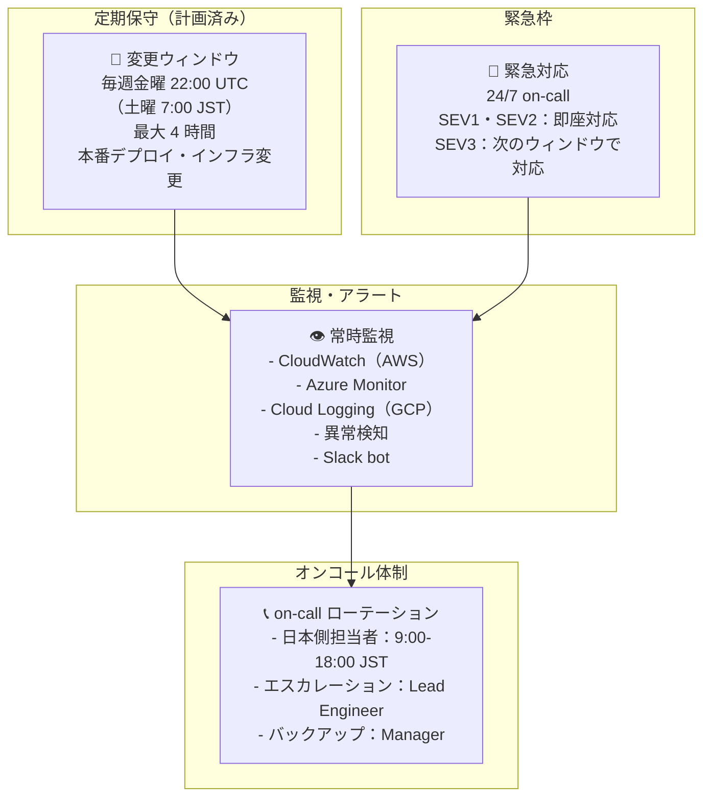
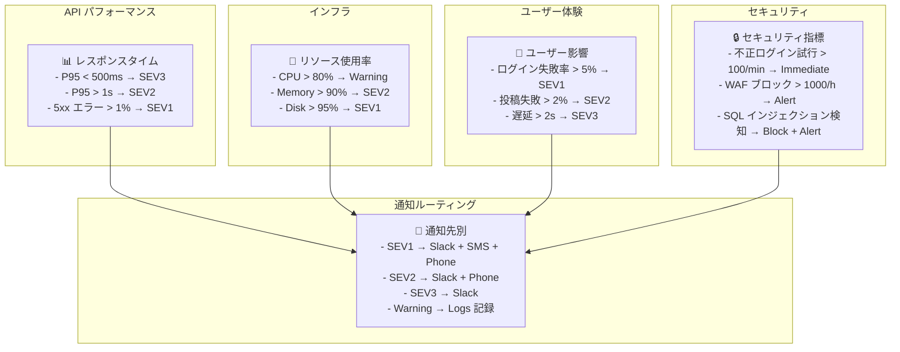

# テスト戦略と運用ダイアグラム

> 包括的なテスト戦略、QA フロー、本番運用手順を可視化したダイアグラム集

---

## 1. テストピラミッド（Test Pyramid）

単体テストから E2E テストまでの層構造と実行頻度。



---

## 2. テスト実行マトリックス（Test Matrix）

各クラウド・環境における テスト実行パターン。



---

## 3. テストメンテナンスカレンダー

定期的なテスト実行・更新スケジュール。



---

## 4. 本番運用フロー（Operations Workflow）

アラートから対応完了までのプロセス。



---

## 5. デプロイメント承認フロー

変更管理と承認プロセス。



---

## 6. ロールバック決定ツリー

本番インシデント時のロールバック判定フロー。

```mermaid
graph TD
    INCIDENT["🚨 本番インシデント<br/>検出"]

    Q1{ユーザーに<br/>影響あり？}

    Q2{15 分で<br/>根本原因<br/>特定できた？}

    Q3{修正は<br/>テスト済み？}

    Q4{デプロイから<br/>24 時間内？}

    Q5{安全なロール<br/>バック経路<br/>ある？}

    ROLLBACK["⏮️ ロールバック<br/>実行（推奨）"]
    HOTFIX["🔧 ホットフィックス<br/>デプロイ"]
    WORKAROUND["🛠️ ワークアラウンド<br/>実装<br/>並行で修正開発"]
    CONTINUE["⏸️ 監視継続<br/>修正方針検討"]

    INCIDENT → Q1

    Q1 -->|NO| CONTINUE
    Q1 -->|YES| Q2

    Q2 -->|NO| ROLLBACK
    Q2 -->|YES| Q3

    Q3 -->|NO| HOTFIX
    Q3 -->|YES| Q4

    Q4 -->|NO| HOTFIX
    Q4 -->|YES| Q5

    Q5 -->|NO| HOTFIX
    Q5 -->|YES| ROLLBACK
```

---

## 7. 本番運用カレンダー

定期保守ウィンドウと緊急対応タイムゾーン。



---

## 8. 監視・アラート設定マトリックス

重要なメトリクスと通知ルール。



---

## 参照

- [AI_AGENT_05_CICD.md](AI_AGENT_05_CICD.md) — CI/CD パイプラインの詳細
- [AI_AGENT_07_RUNBOOKS.md](AI_AGENT_07_RUNBOOKS.md) — 手順書と自動化スクリプト
- [AI_AGENT_13_TESTING.md](AI_AGENT_13_TESTING.md) — テストガイド
- [AI_AGENT_06_STATUS.md](AI_AGENT_06_STATUS.md) — 環境ステータス
