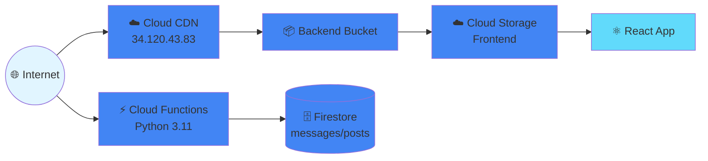
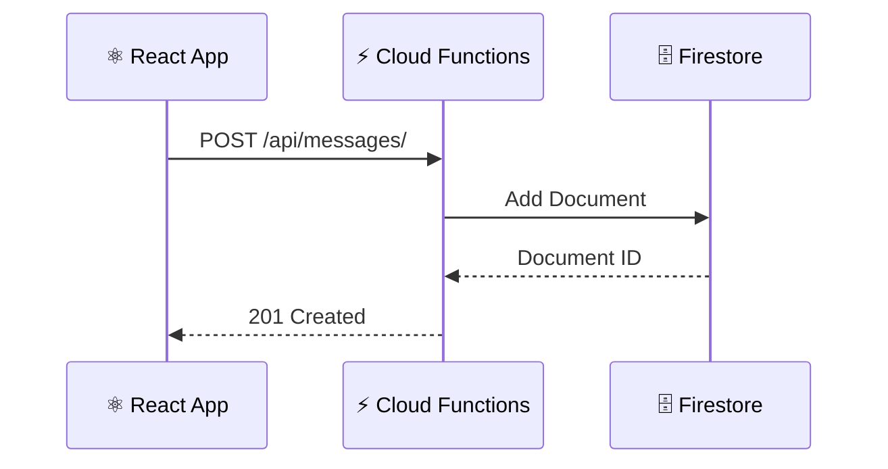

# アーキテクチャドキュメント

Multi-Cloud Auto Deploy Platform の完全なシステムアーキテクチャドキュメント

## 📋 目次

- [システム概要](#システム概要)
- [AWS アーキテクチャ](#aws-アーキテクチャ)
- [Azure アーキテクチャ](#azure-アーキテクチャ)
- [GCP アーキテクチャ](#gcp-アーキテクチャ)
- [技術スタック](#技術スタック)
- [セキュリティ](#セキュリティ)
- [パフォーマンス](#パフォーマンス)

## システム概要


## AWS アーキテクチャ

### 構成図


### リソース構成

| リソース | 名前 | 目的 | リージョン |
|---------|------|------|----------|
| S3 Bucket | `multicloud-auto-deploy-staging-frontend` | フロントエンドホスティング | ap-northeast-1 |
| CloudFront | `E2GDU7Y7UGDV3S` | CDN・HTTPS終端 | Global |
| Lambda | `multicloud-auto-deploy-staging-api` | バックエンドAPI（Python 3.12） | ap-northeast-1 |
| API Gateway | `z42qmqdqac` | HTTP APIゲートウェイ（v2） | ap-northeast-1 |
| DynamoDB | `simple-sns-messages` | NoSQLデータベース（PAY_PER_REQUEST） | ap-northeast-1 |

### アクセスフロー

#### 1. フロントエンドアクセス


#### 2. API呼び出し


### 最小権限IAM

**satoshiユーザー権限**:
- S3: ListBucket, GetObject, PutObject, PutObjectAcl
- CloudFront: CreateInvalidation
- Lambda: CreateFunction, UpdateFunction, GetFunction
- API Gateway: GET, POST, PUT, DELETE
- DynamoDB: DescribeTable, GetItem, PutItem, DeleteItem, Scan
- Pulumi State: S3ベースのリモートステート管理

## Azure アーキテクチャ

### 構成図


### リソース構成

| リソース | 名前 | 目的 | リージョン |
|---------|------|------|----------|
| Resource Group | `multicloud-auto-deploy-staging-rg` | すべてのリソース管理 | japaneast |
| Storage Account | `mcadwebd45ihd` | フロントエンドホスティング（$web） | japaneast |
| Function App | `multicloud-auto-deploy-staging-func` | バックエンドAPI（Python 3.12） | japaneast |
| Cosmos DB | `simple-sns-cosmos` | NoSQLデータベース（Serverless） | japaneast |
| Front Door Profile | `multicloud-frontend-afd` | CDN・WAF | Global |
| Front Door Endpoint | `multicloud-frontend` | CDNエンドポイント | Global |

### アクセスフロー

#### 1. フロントエンドアクセス


#### 2. API呼び出し


### Azure AD統合

**Service Principal権限**:
- Contributor: リソースの作成・管理
- Storage Blob Data Contributor: ストレージへのデータ書き込み

## GCP アーキテクチャ

### 構成図



### リソース構成

| リソース | 名前 | 目的 | リージョン |
|---------|------|------|----------|
| Cloud Storage | `ashnova-multicloud-auto-deploy-staging-frontend` | フロントエンドホスティング | asia-northeast1 |
| Cloud Functions | `multicloud-auto-deploy-staging-api` | バックエンドAPI（Python 3.11） | asia-northeast1 |
| Firestore | `(default)` | NoSQLデータベース | asia-northeast1 |
| Backend Bucket | `multicloud-frontend-backend` | CDN統合 | Global |
| Global IP | `multicloud-frontend-ip` | 固定IPアドレス（34.120.43.83） | Global |
| URL Map | `multicloud-frontend-urlmap` | ルーティング | Global |
| HTTP Proxy | `multicloud-frontend-http-proxy` | HTTP終端 | Global |
| Forwarding Rule | `multicloud-frontend-forwarding-rule` | トラフィック転送 | Global |

### アクセスフロー

#### 1. フロントエンドアクセス（CDN経由）


#### 2. API呼び出し



### IAM権限

**Editorロール保持者**:
- sat0sh1kawada00@gmail.com
- sat0sh1kawada01@gmail.com

**権限範囲**:
- Cloud Functions: デプロイ・管理
- Artifact Registry: イメージ管理
- Firestore: データベース管理
- Cloud Storage: ストレージ管理
- Compute Engine: Load Balancer管理

## 技術スタック

### フロントエンド

| 技術 | バージョン | 用途 |
|------|----------|------|
| React | 18.2.0 | UIライブラリ |
| TypeScript | 5.0.2 | 型安全性 |
| Vite | 5.0.8 | ビルドツール・開発サーバー |
| Tailwind CSS | 3.4.0 | スタイリング |
| Axios | 1.6.5 | HTTP クライアント |

**主要機能**:
- メッセージCRUD操作
- クラウドプロバイダー自動検出表示
- レスポンシブデザイン
- リアルタイム更新

### バックエンド

| 技術 | バージョン | 用途 |
|------|----------|------|
| Python | 3.11 | ランタイム |
| FastAPI | 0.109.0 | Webフレームワーク |
| Uvicorn | 0.27.0 | ASGI サーバー |
| Pydantic | 2.5.3 | データバリデーション |
| boto3 | 1.34.22 | AWS SDK |
| azure-cosmos | 4.5.1 | Azure Cosmos DB SDK |
| google-cloud-firestore | 2.14.0 | GCP Firestore SDK |

**API エンドポイント**:
```
GET  /                     - ルート（クラウド情報）
GET  /api/health          - ヘルスチェック
GET  /api/messages        - メッセージ一覧取得
POST /api/messages        - メッセージ作成
DELETE /api/messages/{id} - メッセージ削除
```

**クラウド自動検出ロジック**:
```python
# 環境変数による検出
AWS_EXECUTION_ENV → "AWS"
WEBSITE_INSTANCE_ID → "Azure"
K_SERVICE → "GCP"
その他 → "Local"
```

### インフラストラクチャ

| ツール | バージョン | 用途 |
|-------|----------|------|
| Pulumi | 3.x | IaC（Infrastructure as Code） |
| Docker | 24.0+ | コンテナ化 |
| GitHub Actions | - | CI/CD |

### データベース

| クラウド | サービス | タイプ | スキーマ |
|---------|---------|-------|---------|
| AWS | DynamoDB | NoSQL | `messages` テーブル |
| Azure | Cosmos DB | NoSQL | `messages` データベース |
| GCP | Firestore | NoSQL | `messages` コレクション |

**共通データモデル**:
```json
{
  "id": "uuid-string",
  "text": "message content",
  "timestamp": "ISO 8601 datetime",
  "cloud": "AWS|Azure|GCP"
}
```

## セキュリティ

### 認証・認可

#### AWS
- **IAM User**: satoshi（最小権限原則）
- **Lambda Execution Role**: DynamoDBアクセス権限
- **S3 Bucket**: パブリック読み取り（静的サイト）
- **API Gateway**: パブリックアクセス（認証なし）

#### Azure
- **Service Principal**: pulumi-deploy（Contributorロール）
- **Container App**: マネージドID
- **Storage Account**: パブリック読み取り（静的サイト）

#### GCP
- **User Accounts**: Editor ロール
- **Cloud Run**: allUsers invoker 権限
- **Cloud Storage**: allUsers objectViewer 権限

### ネットワークセキュリティ

#### AWS
- CloudFront HTTPS強制
- API Gateway CORS設定
- Lambda VPC統合（オプション）

#### Azure
- Azure Front Door HTTPS強制
- Container Apps Ingress制御
- Private Endpoint（オプション）

#### GCP
- HTTPS Load Balancer（計画中）
- Cloud Armor WAF（計画中）
- VPC Service Controls（オプション）

### データ保護

- **送信中の暗号化**: HTTPS/TLS 1.2+
- **保存時の暗号化**: 
  - AWS: S3/DynamoDB標準暗号化
  - Azure: Storage/Cosmos DB標準暗号化
  - GCP: Cloud Storage/Firestore標準暗号化

## パフォーマンス

### フロントエンド最適化

| 項目 | AWS | Azure | GCP |
|-----|-----|-------|-----|
| CDN | CloudFront | Azure Front Door | Cloud CDN |
| キャッシュTTL | 86400秒 | デフォルト | 3600秒 |
| Gzip圧縮 | ✅ | ✅ | ✅ |
| HTTP/2 | ✅ | ✅ | ✅ |
| 静的アセット最適化 | ✅ | ✅ | ✅ |

### バックエンド最適化

| 項目 | AWS Lambda | Azure Functions | GCP Cloud Functions |
|-----|-----------|-----------------|---------------------|
| コールドスタート | 〜500ms | 〜1s | 〜500ms |
| メモリ | 512 MB | 512 MB | 512 MiB |
| タイムアウト | 30s | 60s | 60s |
| 同時実行数 | 1000 | 200 | 10 |
| オートスケール | ✅ | ✅ | ✅ |

### データベース最適化

| 項目 | DynamoDB | Cosmos DB | Firestore |
|-----|----------|-----------|-----------|
| 読み込み待機時間 | <10ms | <10ms | <10ms |
| インデックス | id (primary key) | id (partition key) | id (document ID) |
| 整合性 | 結果的整合性 | セッション整合性 | 強整合性オプション |
| バックアップ | 自動 | 自動 | 自動 |

### パフォーマンス指標

**目標値**:
- ページ読み込み時間: < 2秒
- API レスポンス時間: < 200ms
- スループット: 1000 req/s以上
- 可用性: 99.9%以上

## スケーラビリティ

### 自動スケーリング

#### AWS
- Lambda: 同時実行数に応じて自動スケール
- DynamoDB: オンデマンドキャパシティ
- CloudFront: 自動グローバルスケール

#### Azure
- Container Apps: 0-10レプリカで自動スケール
- Cosmos DB: サーバーレスモード
- Front Door: 自動グローバルスケール

#### GCP
- Cloud Run: 0-1000インスタンスで自動スケール
- Firestore: 自動スケール
- Cloud CDN: 自動グローバルスケール

### 負荷分散

| クラウド | ロードバランサー | ヘルスチェック |
|---------|----------------|-------------|
| AWS | API Gateway | Lambda自動 |
| Azure | Container Apps Ingress | HTTP /api/health |
| GCP | Cloud Functions Internal LB | HTTP / |

## モニタリング・ログ

### メトリクス収集

#### AWS
- CloudWatch Metrics: Lambda実行時間、エラー率
- CloudWatch Logs: Lambda実行ログ
- X-Ray: 分散トレーシング（オプション）

#### Azure
- Azure Monitor: Container Appsメトリクス
- Application Insights: APM
- Log Analytics: 集約ログ

#### GCP
- Cloud Monitoring: Cloud Runメトリクス
- Cloud Logging: 実行ログ
- Cloud Trace: 分散トレーシング

### アラート設定（推奨）

- エラー率 > 5%
- レスポンスタイム > 1秒
- 可用性 < 99%
- コスト異常検知

## ディザスタリカバリ

### バックアップ戦略

| データ | AWS | Azure | GCP |
|-------|-----|-------|-----|
| DynamoDB/Cosmos/Firestore | 継続的バックアップ | 自動バックアップ | 日次自動 |
| 復旧時間目標（RTO） | < 1時間 | < 1時間 | < 1時間 |
| 復旧ポイント目標（RPO） | < 5分 | < 5分 | < 5分 |

### 可用性設計

- **マルチリージョン**: 各クラウドで異なるリージョン使用
- **フェイルオーバー**: DNS/CDNレベルでの切り替え
- **データレプリケーション**: データベース自動レプリケーション

## コスト最適化

### 月間コスト見積もり（低トラフィック想定）

| クラウド | サービス | 月額コスト（USD） |
|---------|---------|-----------------|
| **AWS** | CloudFront | $1-5 |
| | S3 | $0.5-2 |
| | Lambda | $0-5（無料枠内） |
| | API Gateway | $3.5-10 |
| | DynamoDB | $0-5（オンデマンド） |
| | **合計** | **$5-27** |
| **Azure** | Front Door | $35-50 |
| | Storage | $0.5-2 |
| | Container Apps | $0-10（無料枠） |
| | Cosmos DB | $0-25（サーバーレス） |
| | **合計** | **$35-87** |
| **GCP** | Cloud CDN | $0-5 |
| | Cloud Storage | $0.5-2 |
| | Cloud Functions | $0-5（無料枠） |
| | Firestore | $0-5（無料枠） |
| | **合計** | **$0.5-17** |

**注**: トラフィック量、データ容量、実行時間により変動

### コスト削減策

1. **無料枠の活用**
   - AWS: Lambda 100万リクエスト/月
   - Azure: Container Apps 180,000 vCPU秒/月
   - GCP: Cloud Run 200万リクエスト/月

2. **リソースの最適化**
   - Lambda/Cloud Run: メモリサイズの最適化
   - Container Apps: レプリカ数の調整
   - データベース: 使用量モニタリング

3. **予約インスタンス**（本番環境）
   - AWS: Savings Plans
   - Azure: Reserved Instances
   - GCP: Committed Use Discounts

## 今後の改善計画

### フェーズ1: セキュリティ強化
- [ ] 認証・認可の実装（Cognito/Azure AD/Firebase Auth）
- [ ] WAF の設定
- [ ] HTTPS完全対応（GCP）
- [ ] シークレット管理の統一

### フェーズ2: 監視・運用
- [ ] 統合ダッシュボード構築
- [ ] アラート設定
- [ ] ログ集約
- [ ] エラートラッキング（Sentry等）

### フェーズ3: CI/CD完全自動化
- [ ] GitHub Actions有効化
- [ ] 自動テストの拡充
- [ ] ブルー・グリーンデプロイ
- [ ] カナリアリリース

### フェーズ4: 機能拡張
- [ ] ユーザー認証
- [ ] ファイルアップロード
- [ ] リアルタイム通信（WebSocket）
- [ ] 検索機能

## 参考資料

- [AWS Well-Architected Framework](https://aws.amazon.com/architecture/well-architected/)
- [Azure Architecture Center](https://learn.microsoft.com/azure/architecture/)
- [Google Cloud Architecture Framework](https://cloud.google.com/architecture/framework)


## フロントエンド

### 技術スタック

- **React 18**: UIライブラリ
- **TypeScript**: 型安全性
- **Vite**: ビルドツール
- **Tailwind CSS**: スタイリング
- **Axios**: HTTP クライアント

### デプロイ先

| クラウド | サービス | URL形式 |
|---------|---------|---------|
| AWS | S3 + CloudFront | `https://xxx.cloudfront.net` |
| Azure | Static Web Apps | `https://xxx.azurestaticapps.net` |
| GCP | Cloud Storage + CDN | `https://storage.googleapis.com/xxx` |

## バックエンド

### 技術スタック

- **FastAPI**: Pythonウェブフレームワーク
- **Python 3.11**: ランタイム
- **Pydantic**: データバリデーション
- **Uvicorn**: ASGI サーバー

### API エンドポイント

```
GET  /                     - ルート
GET  /api/health          - ヘルスチェック
GET  /api/messages        - メッセージ一覧
POST /api/messages        - メッセージ作成
GET  /api/messages/{id}   - メッセージ取得
DELETE /api/messages/{id} - メッセージ削除
```

### デプロイ先

| クラウド | サービス | 特徴 |
|---------|---------|------|
| AWS | Lambda + API Gateway | サーバーレス、オートスケール |
| Azure | Azure Functions | サーバーレス、統合認証 |
| GCP | Cloud Functions | サーバーレス、HTTPトリガー |

## データベース

### 選択肢

| クラウド | サービス | タイプ | 用途 |
|---------|---------|-------|------|
| AWS | DynamoDB | NoSQL | 高速、スケーラブル |
| AWS | RDS (PostgreSQL) | SQL | リレーショナル |
| Azure | Cosmos DB | NoSQL | グローバル分散 |
| Azure | Azure SQL | SQL | エンタープライズ |
| GCP | Firestore | NoSQL | リアルタイム |
| GCP | Cloud SQL | SQL | マネージド |

## CI/CD パイプライン

```
┌─────────────┐
│   GitHub    │
│ Repository  │
└──────┬──────┘
       │ Push/PR
┌──────▼───────────┐
│ GitHub Actions   │
├──────────────────┤
│ 1. Checkout      │
│ 2. Build         │
│ 3. Test          │
│ 4. Package       │
└──────┬───────────┘
       │
   ┌───┴───┬───────┬───────┐
   ▼       ▼       ▼       ▼
┌─────┐ ┌─────┐ ┌─────┐ ┌──────┐
│ AWS │ │Azure│ │ GCP │ │Local │
└─────┘ └─────┘ └─────┘ └──────┘
```

### ワークフロー

1. **Trigger**: Push to main or Manual
2. **Build**: 
   - Frontend: `npm run build`
   - Backend: `pip install` + `zip`
3. **Test**: 
   - Frontend: `vitest`
   - Backend: `pytest`
4. **Deploy Infrastructure**: Pulumi
5. **Deploy Application**: 
   - Frontend → S3/Storage
   - Backend → Lambda/Functions
6. **Notify**: Success/Failure

## Infrastructure as Code

### Pulumi

```python
# Python SDKによるインフラ定義
infrastructure/pulumi/
├── aws/
│   ├── __main__.py    # メインスタック
│   ├── frontend.py    # S3 + CloudFront
│   ├── backend.py     # Lambda + API Gateway
│   ├── database.py    # DynamoDB
│   └── Pulumi.yaml    # プロジェクト設定
├── azure/
│   ├── __main__.py    # メインスタック
│   ├── frontend.py    # Storage Account + Front Door
│   ├── backend.py     # Azure Functions
│   └── database.py    # Cosmos DB
└── gcp/
    ├── __main__.py    # メインスタック
    ├── frontend.py    # Cloud Storage + CDN
    ├── backend.py     # Cloud Run
    └── database.py    # Firestore

import pulumi
import pulumi_aws as aws

bucket = aws.s3.Bucket("frontend",
    website={
        "index_document": "index.html"
    })
```

## セキュリティ

### 認証・認可

- **AWS**: Cognito
- **Azure**: Azure AD B2C
- **GCP**: Firebase Auth

### ネットワーク

- HTTPS強制
- CORS設定
- APIキー（オプション）

### シークレット管理

- **AWS**: Secrets Manager / Parameter Store
- **Azure**: Key Vault
- **GCP**: Secret Manager

## スケーリング

### 水平スケーリング

| サービス | 自動スケール | 最大 |
|---------|-------------|------|
| Lambda | あり | 1000 並列 |
| Azure Functions | あり | 200 インスタンス |
| Cloud Functions | あり | 設定可能 |

### データベーススケーリング

- **DynamoDB**: オンデマンド課金
- **Cosmos DB**: RU/s 自動スケール
- **Firestore**: 自動

## モニタリング

### メトリクス

- リクエスト数
- レスポンスタイム
- エラー率
- コスト

### ログ

- **AWS**: CloudWatch Logs
- **Azure**: Application Insights
- **GCP**: Cloud Logging

### アラート

- エラー閾値超過
- レイテンシ増加
- コスト異常

## ディザスタリカバリ

### バックアップ

- データベーススナップショット
- S3バージョニング
- マルチリージョン対応

### RTO/RPO

- **RTO** (Recovery Time Objective): < 1時間
- **RPO** (Recovery Point Objective): < 5分

## パフォーマンス最適化

### フロントエンド

- Code Splitting
- Lazy Loading
- CDNキャッシング
- 画像最適化

### バックエンド

- コネクションプーリング
- キャッシング (Redis)
- 非同期処理
- バッチ処理

## コスト最適化

### 戦略

1. **サーバーレス優先**: 使用量課金
2. **オートスケール**: 需要に応じて調整
3. **リザーブドインスタンス**: 予測可能な負荷
4. **ストレージクラス**: ライフサイクルポリシー

### コスト比較（月額概算、小規模）

| クラウド | フロントエンド | バックエンド | DB | 合計 |
|---------|--------------|-------------|----|----|
| AWS | $2 | $1 | $1 | $4 |
| Azure | $0* | $1 | $1 | $2 |
| GCP | $1 | $1 | $1 | $3 |

*Azure Static Web Appsの無料枠

## 今後の拡張

- Kubernetes対応
- マルチリージョンデプロイ
- Blue-Greenデプロイ
- A/Bテスト機能
- メトリクスダッシュボード
