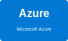

# Azure Deployment Guide



Azure Container Appsを使用したマルチクラウド自動デプロイシステムのデプロイガイド

## 📋 目次

- [前提条件](#前提条件)
- [デプロイ手順](#デプロイ手順)
- [リソース構成](#リソース構成)
- [検証](#検証)
- [トラブルシューティング](#トラブルシューティング)

## 🔧 前提条件

### 必要なツール

```bash
# Azure CLI
curl -sL https://aka.ms/InstallAzureCLIDeb | sudo bash

# Pulumi
curl -fsSL https://get.pulumi.com | sh
export PATH=$PATH:$HOME/.pulumi/bin

# Docker
sudo apt-get update
sudo apt-get install docker.io
```

### Azure認証情報

1. **Azureにログイン**
```bash
az login
```

2. **サブスクリプションの確認**
```bash
az account list --output table
az account set --subscription "YOUR_SUBSCRIPTION_ID"
```

3. **Service Principalの作成**
```bash
az ad sp create-for-rbac --name "pulumi-deploy" \
  --role Contributor \
  --scopes /subscriptions/YOUR_SUBSCRIPTION_ID
```

出力例：
```json
{
  "appId": "00000000-0000-0000-0000-000000000000",
  "displayName": "pulumi-deploy",
  "password": "xxxxxxxxxxxxxxxxxxxxxxxxxxxxx",
  "tenant": "00000000-0000-0000-0000-000000000000"
}
```

## 🚀 デプロイ手順

### Step 1: 環境変数の設定

```bash
export ARM_CLIENT_ID="<appId>"
export ARM_CLIENT_SECRET="<password>"
export ARM_SUBSCRIPTION_ID="<subscription_id>"
export ARM_TENANT_ID="<tenant>"
```

### Step 2: Pulumiスタックの初期化

```bash
cd infrastructure/pulumi/azure
pulumi stack init staging
pulumi config set azure-native:location japaneast
pulumi config set environment staging
```

### Step 3: インフラストラクチャのデプロイ

```bash
pulumi up
```

デプロイされるリソース：
- Resource Group
- Container Registry
- Container Apps Environment
- Container App (Backend)
- Storage Account (Frontend)
- Azure Front Door
- Cosmos DB

### Step 4: Dockerイメージのビルドとプッシュ

```bash
cd ../../services/backend

# Container Registryにログイン
az acr login --name <registry_name>

# Dockerイメージのビルド（linux/amd64プラットフォーム）
docker build --platform linux/amd64 \
  -t <registry_name>.azurecr.io/multicloud-auto-deploy-api:latest \
  -f Dockerfile.azure .

# イメージのプッシュ
docker push <registry_name>.azurecr.io/multicloud-auto-deploy-api:latest
```

### Step 5: Container Appの更新

```bash
# Container Appが新しいイメージを使用するように更新
az containerapp update \
  --name mcad-staging-api \
  --resource-group multicloud-auto-deploy-staging-rg \
  --image <registry_name>.azurecr.io/multicloud-auto-deploy-api:latest
```

### Step 6: フロントエンドのデプロイ

```bash
cd ../frontend

# 環境変数を設定してビルド
export VITE_API_URL=https://<container_app_url>
npm run build

# Storage Accountにアップロード
az storage blob upload-batch \
  --account-name <storage_account_name> \
  --source ./dist \
  --destination '$web' \
  --overwrite
```

## 🏗️ リソース構成

### デプロイされるリソース

| リソース | 名前 | 目的 |
|---------|------|------|
| Resource Group | `multicloud-auto-deploy-staging-rg` | すべてのリソースを格納 |
| Container Registry | `mcadstagingacr` | Dockerイメージの保存 |
| Container Apps Environment | `mcad-staging-env` | Container Appsの実行環境 |
| Container App | `mcad-staging-api` | バックエンドAPI |
| Storage Account | `mcadfestaging` | フロントエンドホスティング |
| Cosmos DB | `multicloud-auto-deploy-staging-cosmos` | NoSQLデータベース |
| Azure Front Door | `multicloud-auto-deploy-staging-endpoint` | CDN・SSL終端 |

### ネットワーク構成

```
Internet
   │
   ├─→ Azure Front Door (CDN) ──→ Storage Account (Frontend)
   │                                    └─→ Static Website
   │
   └─→ Container App (Backend) ──→ Cosmos DB
           └─→ Public Ingress
```

## ✅ 検証

### 1. バックエンドAPIの確認

```bash
# APIエンドポイントの取得
BACKEND_URL=$(terraform output -raw api_url)

# ヘルスチェック
curl $BACKEND_URL/api/health

# メッセージ作成
curl -X POST $BACKEND_URL/api/messages \
  -H "Content-Type: application/json" \
  -d '{"text":"Azure Container Apps test"}'

# メッセージ取得
curl $BACKEND_URL/api/messages
```

### 2. フロントエンドの確認

```bash
# フロントエンドURLの取得
FRONTEND_URL=$(terraform output -raw frontend_url)

# アクセステスト
curl -I $FRONTEND_URL
```

ブラウザで `$FRONTEND_URL` にアクセスして動作確認

### 3. Cosmos DBの確認

```bash
# Azure Portalでデータを確認
az cosmosdb sql database show \
  --account-name <cosmos_account> \
  --name messages \
  --resource-group multicloud-auto-deploy-staging-rg
```

## 🔧 トラブルシューティング

### Container Appが起動しない

**症状**: Container Appのステータスが `Failed`

**原因と対処**:

1. **イメージが見つからない**
```bash
# Container Registryのイメージを確認
az acr repository list --name <registry_name> --output table

# イメージタグを確認
az acr repository show-tags --name <registry_name> \
  --repository multicloud-auto-deploy-api --output table
```

2. **プラットフォームの不一致**
```bash
# linux/amd64でビルドし直す
docker build --platform linux/amd64 -f Dockerfile.azure .
```

3. **環境変数の不足**
```bash
# Container Appの環境変数を確認
az containerapp show --name mcad-staging-api \
  --resource-group multicloud-auto-deploy-staging-rg \
  --query properties.template.containers[0].env
```

### Static Websiteが表示されない

**症状**: フロントエンドにアクセスすると404エラー

**対処**:

1. **Static Website機能の有効化確認**
```bash
az storage blob service-properties show \
  --account-name <storage_account_name> \
  --query staticWebsite
```

2. **ファイルのアップロード確認**
```bash
az storage blob list \
  --account-name <storage_account_name> \
  --container-name '$web' \
  --output table
```

### Cosmos DBへの接続エラー

**症状**: バックエンドがデータベースに接続できない

**対処**:

1. **接続文字列の確認**
```bash
az cosmosdb keys list \
  --name <cosmos_account> \
  --resource-group multicloud-auto-deploy-staging-rg \
  --type connection-strings
```

2. **ファイアウォール設定の確認**
```bash
# Container AppのIPを許可リストに追加
az cosmosdb update \
  --name <cosmos_account> \
  --resource-group multicloud-auto-deploy-staging-rg \
  --ip-range-filter "0.0.0.0/0"  # 開発環境のみ
```

### Azure Front Doorの設定

**症状**: カスタムドメインが動作しない

**対処**:

```bash
# Front Doorのエンドポイントを確認
az afd endpoint list \
  --profile-name <front_door_profile> \
  --resource-group multicloud-auto-deploy-staging-rg \
  --output table

# カスタムドメインの追加
az afd custom-domain create \
  --custom-domain-name example-com \
  --profile-name <front_door_profile> \
  --resource-group multicloud-auto-deploy-staging-rg \
  --host-name example.com \
  --minimum-tls-version TLS12
```

## 📊 クォータと制限

### Container Apps

- 無料プラン: 180,000 vCPU秒/月、360,000 GiB秒/月
- CPU: 0.25〜4.0 vCPU
- メモリ: 0.5〜8.0 GiB
- リクエストタイムアウト: 240秒

### Cosmos DB

- 無料プラン: 1,000 RU/s、25 GB
- サーバーレスモード: 使用量課金
- スループット: 400〜1,000,000 RU/s

### Storage Account

- 無料プラン（12ヶ月）: 5 GB、20,000リクエスト
- 静的Webサイト: 無制限
- 帯域幅: 15 GB送信/月（無料枠）

## 🔗 関連リンク

- [Azure Container Apps Documentation](https://learn.microsoft.com/azure/container-apps/)
- [Azure Cosmos DB Documentation](https://learn.microsoft.com/azure/cosmos-db/)
- [Azure Front Door Documentation](https://learn.microsoft.com/azure/frontdoor/)
- [Azure Storage Static Website](https://learn.microsoft.com/azure/storage/blobs/storage-blob-static-website)

## 📝 次のステップ

- ✅ デプロイ完了
- [ ] カスタムドメインの設定
- [ ] SSL証明書の設定
- [ ] モニタリングの設定
- [ ] CI/CDパイプラインの構築
