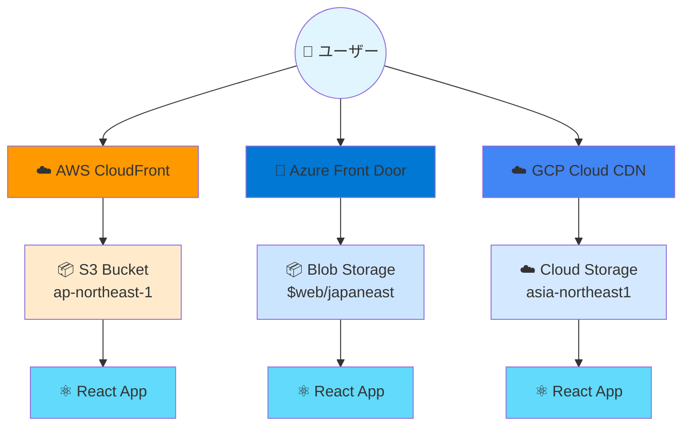

# CDNセットアップガイド

全3クラウド（AWS、Azure、GCP）でCDNを使用した高速コンテンツ配信の設定ガイド

## 📋 目次

- [概要](#概要)
- [Pulumiによる自動デプロイ](#pulumiによる自動デプロイ) 🆕
- [AWS CloudFront](#aws-cloudfront)
- [Azure Front Door](#azure-front-door)
- [GCP Cloud CDN](#gcp-cloud-cdn)
- [パフォーマンス比較](#パフォーマンス比較)
- [キャッシュ管理](#キャッシュ管理)

---

## 概要

このプロジェクトでは、全3クラウドプロバイダーでCDNを使用してReactフロントエンドを配信しています。

### アーキテクチャ



### CDN URL一覧

#### 本番環境（手動構築）
| クラウド | CDN URL | オリジン | 管理方法 |
|---------|---------|----------|----------|
| **AWS** | https://dx3l4mbwg1ade.cloudfront.net | S3 (ap-northeast-1) | 手動 |
| **Azure** | https://multicloud-frontend-f9cvamfnauexasd8.z01.azurefd.net | Blob Storage (japaneast) | 手動 |
| **GCP** | http://34.120.43.83 | Cloud Storage (asia-northeast1) | 手動 |

#### Pulumi管理環境 🆕
| クラウド | CDN URL | オリジン | 管理方法 |
|---------|---------|----------|----------|
| **AWS** | https://d1tf3uumcm4bo1.cloudfront.net | S3 (ap-northeast-1) | Pulumi |
| **Azure** | https://mcad-staging-d45ihd-dseygrc9c3a3htgj.z01.azurefd.net | Blob Storage (japaneast) | Pulumi |
| **GCP** | http://34.117.111.182 | Cloud Storage (asia-northeast1) | Pulumi |

---

## Pulumiによる自動デプロイ

全3クラウドのCDNリソースをPulumiで管理できます。Infrastructure as Codeで一貫性のある環境を構築。

### 前提条件

```bash
# Pulumi CLIインストール確認
pulumi version

# Pulumiにログイン（ローカルバックエンド）
pulumi login --local
```

### AWS CloudFront デプロイ

```bash
cd infrastructure/pulumi/aws

# 依存関係インストール
pip install -r requirements.txt

# スタック選択
pulumi stack select staging

# プレビュー
pulumi preview

# デプロイ
pulumi up

# Output確認
pulumi stack output cloudfront_url
# 出力: https://d1tf3uumcm4bo1.cloudfront.net
```

**作成されるリソース:**
- CloudFront Distribution
- Origin Access Identity (OAI)
- S3 Bucket Policy（OAIアクセス設定）
- カスタムエラーレスポンス（SPA対応）

**注意:** Lambda関数コードは`ignore_changes`で除外されています。コードは別途`scripts/deploy-lambda-aws.sh`でデプロイしてください。

### Azure Front Door デプロイ

```bash
cd infrastructure/pulumi/azure

# 依存関係インストール
pip install -r requirements.txt

# スタック選択
pulumi stack select staging

# プレビュー
pulumi preview

# デプロイ
pulumi up

# Output確認
pulumi stack output frontdoor_url
# 出力: https://mcad-staging-d45ihd-dseygrc9c3a3htgj.z01.azurefd.net
```

**作成されるリソース:**
- Azure Front Door Profile (Standard)
- Front Door Endpoint
- Origin Group（ロードバランシング + ヘルスチェック）
- Origin（Storage Account）
- Route（HTTPS強制、パターンマッチング）

**注意:** Function Appは手動管理です。Pulumiでは管理しません。

### GCP Cloud CDN デプロイ

```bash
cd infrastructure/pulumi/gcp

# 依存関係インストール
pip install -r requirements.txt

# GCPプロジェクト設定
pulumi config set gcp:project ashnova
pulumi config set gcp:region asia-northeast1

# スタック選択
pulumi stack select staging

# プレビュー
pulumi preview

# デプロイ
pulumi up

# Output確認
pulumi stack output cdn_url
# 出力: http://34.117.111.182
```

**作成されるリソース:**
- Global Address（外部IP）
- Backend Bucket（Cloud CDN有効化）
- URL Map
- Target HTTP Proxy
- Global Forwarding Rule

### 全クラウド一括デプロイ

```bash
# AWS
(cd infrastructure/pulumi/aws && pulumi up --yes)

# Azure
(cd infrastructure/pulumi/azure && pulumi up --yes)

# GCP
(cd infrastructure/pulumi/gcp && pulumi up --yes)
```

### Pulumi State確認

```bash
# AWS
cd infrastructure/pulumi/aws
pulumi stack
pulumi stack output

# Azure  
cd infrastructure/pulumi/azure
pulumi stack
pulumi stack output

# GCP
cd infrastructure/pulumi/gcp
pulumi stack
pulumi stack output
```

---

## AWS CloudFront

### 既存Distributionの確認

```bash
# Distribution一覧取得
aws cloudfront list-distributions \
  --query 'DistributionList.Items[].{Id:Id,DomainName:DomainName,Origin:Origins.Items[0].DomainName}' \
  --output table

# 特定のDistribution詳細
aws cloudfront get-distribution \
  --id E2GDU7Y7UGDV3S
```

### 設定内容

| 項目 | 値 |
|-----|-----|
| **Distribution ID** | E2GDU7Y7UGDV3S |
| **Domain Name** | dx3l4mbwg1ade.cloudfront.net |
| **Origin** | multicloud-auto-deploy-staging-frontend.s3.ap-northeast-1.amazonaws.com |
| **Price Class** | PriceClass_100 |
| **Default Root Object** | index.html |
| **HTTP Version** | http2 |

### キャッシュクリア

```bash
# 全ファイルのキャッシュ無効化
aws cloudfront create-invalidation \
  --distribution-id E2GDU7Y7UGDV3S \
  --paths "/*"

# 特定ファイルのみ
aws cloudfront create-invalidation \
  --distribution-id E2GDU7Y7UGDV3S \
  --paths "/index.html" "/assets/*"

# Invalidation状態確認
aws cloudfront get-invalidation \
  --distribution-id E2GDU7Y7UGDV3S \
  --id <INVALIDATION_ID>
```

### フロントエンドデプロイ手順

```bash
cd services/frontend_react

# ビルド
echo "VITE_API_URL=https://z42qmqdqac.execute-api.ap-northeast-1.amazonaws.com" > .env
npm run build

# S3アップロード
aws s3 sync dist/ s3://multicloud-auto-deploy-staging-frontend/ --delete

# CloudFront キャッシュクリア
aws cloudfront create-invalidation \
  --distribution-id E2GDU7Y7UGDV3S \
  --paths "/*"
```

---

## Azure Front Door

### セットアップ（既存環境）

```bash
# Front Door Profile確認
az afd profile show \
  --profile-name multicloud-frontend-afd \
  --resource-group multicloud-auto-deploy-staging-rg

# Endpoint確認
az afd endpoint show \
  --profile-name multicloud-frontend-afd \
  --endpoint-name multicloud-frontend \
  --resource-group multicloud-auto-deploy-staging-rg

# Origin確認
az afd origin show \
  --profile-name multicloud-frontend-afd \
  --origin-group-name storage-origin-group \
  --origin-name storage-origin \
  --resource-group multicloud-auto-deploy-staging-rg
```

### 新規セットアップ手順

```bash
RESOURCE_GROUP="multicloud-auto-deploy-staging-rg"
PROFILE_NAME="multicloud-frontend-afd"
ENDPOINT_NAME="multicloud-frontend"
STORAGE_HOST="mcadwebd45ihd.z11.web.core.windows.net"

# 1. Front Door Profile作成
az afd profile create \
  --profile-name $PROFILE_NAME \
  --resource-group $RESOURCE_GROUP \
  --sku Standard_AzureFrontDoor

# 2. Endpoint作成
az afd endpoint create \
  --profile-name $PROFILE_NAME \
  --resource-group $RESOURCE_GROUP \
  --endpoint-name $ENDPOINT_NAME \
  --enabled-state Enabled

# 3. Origin Group作成
az afd origin-group create \
  --profile-name $PROFILE_NAME \
  --origin-group-name storage-origin-group \
  --resource-group $RESOURCE_GROUP \
  --probe-request-type GET \
  --probe-protocol Https \
  --probe-interval-in-seconds 100 \
  --probe-path /

# 4. Origin作成
az afd origin create \
  --profile-name $PROFILE_NAME \
  --origin-group-name storage-origin-group \
  --origin-name storage-origin \
  --resource-group $RESOURCE_GROUP \
  --host-name $STORAGE_HOST \
  --origin-host-header $STORAGE_HOST \
  --priority 1 \
  --weight 1000 \
  --enabled-state Enabled \
  --http-port 80 \
  --https-port 443

# 5. Route作成
az afd route create \
  --profile-name $PROFILE_NAME \
  --endpoint-name $ENDPOINT_NAME \
  --route-name default-route \
  --resource-group $RESOURCE_GROUP \
  --origin-group storage-origin-group \
  --supported-protocols Http Https \
  --https-redirect Enabled \
  --forwarding-protocol HttpsOnly \
  --patterns-to-match "/*"
```

### 設定内容

| 項目 | 値 |
|-----|-----|
| **Profile Name** | multicloud-frontend-afd |
| **Endpoint** | multicloud-frontend |
| **Host Name** | multicloud-frontend-f9cvamfnauexasd8.z01.azurefd.net |
| **Origin** | mcadwebd45ihd.z11.web.core.windows.net |
| **SKU** | Standard_AzureFrontDoor |
| **HTTPS Redirect** | Enabled |

### フロントエンドデプロイ手順

```bash
cd services/frontend_react

# ビルド
echo "VITE_API_URL=https://multicloud-auto-deploy-staging-func-d8a2guhfere0etcq.japaneast-01.azurewebsites.net/api/HttpTrigger" > .env
npm run build

# Blob Storageアップロード
az storage blob upload-batch \
  --account-name mcadwebd45ihd \
  --auth-mode key \
  --destination '$web' \
  --source dist/ \
  --overwrite \
  --pattern "assets/*" \
  --content-cache-control "public, max-age=31536000, immutable"

az storage blob upload \
  --account-name mcadwebd45ihd \
  --auth-mode key \
  --container-name '$web' \
  --file dist/index.html \
  --name index.html \
  --content-cache-control "public, max-age=0, must-revalidate" \
  --overwrite
```

**注意**: Azure Front Doorは自動的にキャッシュを管理しますが、伝播には5-10分かかる場合があります。

---

## GCP Cloud CDN

### セットアップ（既存環境）

```bash
# Backend Bucket確認
gcloud compute backend-buckets describe multicloud-frontend-backend

# URL Map確認
gcloud compute url-maps describe multicloud-frontend-urlmap

# Global IP確認
gcloud compute addresses describe multicloud-frontend-ip --global

# Forwarding Rule確認
gcloud compute forwarding-rules describe multicloud-frontend-forwarding-rule --global
```

### 新規セットアップ手順

```bash
BUCKET_NAME="ashnova-multicloud-auto-deploy-staging-frontend"
BACKEND_BUCKET="multicloud-frontend-backend"
URL_MAP="multicloud-frontend-urlmap"
HTTP_PROXY="multicloud-frontend-http-proxy"
IP_NAME="multicloud-frontend-ip"
FORWARDING_RULE="multicloud-frontend-forwarding-rule"

# 1. Backend Bucket作成
gcloud compute backend-buckets create $BACKEND_BUCKET \
  --gcs-bucket-name=$BUCKET_NAME \
  --enable-cdn \
  --cache-mode=CACHE_ALL_STATIC \
  --default-ttl=3600 \
  --max-ttl=86400

# 2. URL Map作成
gcloud compute url-maps create $URL_MAP \
  --default-backend-bucket=$BACKEND_BUCKET

# 3. Target HTTP Proxy作成
gcloud compute target-http-proxies create $HTTP_PROXY \
  --url-map=$URL_MAP

# 4. Global IP予約
gcloud compute addresses create $IP_NAME \
  --ip-version=IPV4 \
  --global

# 5. Forwarding Rule作成
gcloud compute forwarding-rules create $FORWARDING_RULE \
  --address=$IP_NAME \
  --global \
  --target-http-proxy=$HTTP_PROXY \
  --ports=80
```

### 設定内容

| 項目 | 値 |
|-----|-----|
| **Global IP** | 34.120.43.83 |
| **Backend Bucket** | multicloud-frontend-backend |
| **GCS Bucket** | ashnova-multicloud-auto-deploy-staging-frontend |
| **Cache Mode** | CACHE_ALL_STATIC |
| **Default TTL** | 3600s (1 hour) |
| **Max TTL** | 86400s (24 hours) |

### キャッシュクリア

```bash
# URL Mapを使用してキャッシュ無効化
gcloud compute url-maps invalidate-cdn-cache multicloud-frontend-urlmap \
  --path "/*" \
  --async

# 特定パスのみ
gcloud compute url-maps invalidate-cdn-cache multicloud-frontend-urlmap \
  --path "/index.html" \
  --path "/assets/*" \
  --async
```

### フロントエンドデプロイ手順

```bash
cd services/frontend_react

# ビルド
echo "VITE_API_URL=https://multicloud-auto-deploy-staging-api-899621454670.asia-northeast1.run.app" > .env
npm run build

# Cloud Storageアップロード
gcloud storage rsync --recursive --delete-unmatched-destination-objects \
  --cache-control="public, max-age=31536000, immutable" \
  dist/assets/ gs://ashnova-multicloud-auto-deploy-staging-frontend/assets/

gcloud storage cp dist/vite.svg \
  gs://ashnova-multicloud-auto-deploy-staging-frontend/vite.svg \
  --cache-control="public, max-age=31536000, immutable"

gcloud storage cp dist/index.html \
  gs://ashnova-multicloud-auto-deploy-staging-frontend/index.html \
  --cache-control="public, max-age=0, must-revalidate"

# Cloud CDNキャッシュクリア
gcloud compute url-maps invalidate-cdn-cache multicloud-frontend-urlmap \
  --path "/*" --async
```

---

## パフォーマンス比較

### レスポンスタイム測定

```bash
# AWS CloudFront
time curl -s https://dx3l4mbwg1ade.cloudfront.net/ > /dev/null

# Azure Front Door
time curl -s https://multicloud-frontend-f9cvamfnauexasd8.z01.azurefd.net/ > /dev/null

# GCP Cloud CDN
time curl -s http://34.120.43.83/index.html > /dev/null
```

### 実測結果（2026年2月15日時点）

| クラウド | レスポンスタイム | キャッシュヒット | 備考 |
|---------|----------------|-----------------|------|
| **AWS CloudFront** | 0.702秒 | Miss → Hit | HTTP/2対応 |
| **GCP Cloud CDN** | **0.109秒** | Hit | 🏆 最速 |
| **Azure Front Door** | 伝播中 | - | HTTPS Redirect有効 |

### キャッシュヘッダー確認

```bash
# AWS CloudFront
curl -I https://dx3l4mbwg1ade.cloudfront.net/
# x-cache: Hit from cloudfront / Miss from cloudfront

# Azure Front Door
curl -I https://multicloud-frontend-f9cvamfnauexasd8.z01.azurefd.net/
# x-cache: TCP_HIT / TCP_MISS

# GCP Cloud CDN
curl -I http://34.120.43.83/index.html
# age: <seconds> (キャッシュ時間)
```

---

## キャッシュ管理

### ベストプラクティス

1. **HTML（index.html）**:
   - Cache-Control: `public, max-age=0, must-revalidate`
   - 常に最新版を取得

2. **静的アセット（JS/CSS/画像）**:
   - Cache-Control: `public, max-age=31536000, immutable`
   - ファイル名にハッシュを含めることで変更を検出

3. **デプロイ後のキャッシュクリア**:
   - 全CDNでキャッシュ無効化を実行
   - index.htmlは最優先で無効化

### キャッシュクリア一括実行

```bash
#!/bin/bash

echo "=== AWS CloudFront ==="
aws cloudfront create-invalidation \
  --distribution-id E2GDU7Y7UGDV3S \
  --paths "/*"

echo -e "\n=== GCP Cloud CDN ==="
gcloud compute url-maps invalidate-cdn-cache multicloud-frontend-urlmap \
  --path "/*" --async

echo -e "\n=== Azure Front Door ==="
echo "Azure Front Doorは自動的にキャッシュを管理します（5-10分で伝播）"
```

---

## トラブルシューティング

### CloudFront: 古いコンテンツが表示される

**原因**: キャッシュが残っている

**解決策**:
```bash
# Invalidation作成
aws cloudfront create-invalidation \
  --distribution-id E2GDU7Y7UGDV3S \
  --paths "/*"

# ブラウザのキャッシュもクリア
# Ctrl+Shift+R（強制リロード）
```

### Azure Front Door: 404エラー

**原因**: Origin設定が間違っているか、伝播中

**解決策**:
```bash
# Origin確認
az afd origin show \
  --profile-name multicloud-frontend-afd \
  --origin-group-name storage-origin-group \
  --origin-name storage-origin \
  --resource-group multicloud-auto-deploy-staging-rg

# deploymentStatus: NotStarted の場合は5-10分待機
```

### GCP Cloud CDN: キャッシュが効かない

**原因**: Cache-Controlヘッダーが設定されていない

**解決策**:
```bash
# Cache-Controlを付けて再アップロード
gcloud storage cp dist/index.html \
  gs://ashnova-multicloud-auto-deploy-staging-frontend/index.html \
  --cache-control="public, max-age=0, must-revalidate"
```

---

## 関連ドキュメント

- [エンドポイント一覧](./ENDPOINTS.md) - 全CDN URLとテスト方法
- [デプロイガイド](./SETUP.md) - 初回デプロイ手順
- [トラブルシューティング](./TROUBLESHOOTING.md) - よくある問題と解決策
