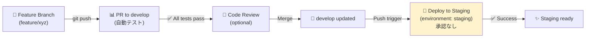

# GitHub Advanced Features Implementation Guide

> **最終更新**: 2026-02-28
> **新実装機能**: GitHub Environments (#8), Code Scanning (既存 #9) + Additional Features

---

## 📌 新規実装完了（2026-02-28）

### ✅ 8️⃣ GitHub Environments

**目的**: 本番・ステージング・開発環境ごとに承認ルールと環境変数を管理

**実装状況**:

- ✅ Production 環境作成完了（@PLAYER1-r7 承認必須、main ブランチのみ）
- ✅ Staging 環境作成完了（承認不要、develop ブランチのみ）
- ✅ Development 環境作成完了（承認不要、全ブランチ対応）
- ✅ 環境変数設定完了（各環境で 7-10 個の変数）

**セットアップ**: [docs/GITHUB_ENVIRONMENTS_GUIDE.md](./GITHUB_ENVIRONMENTS_GUIDE.md)

**具体的な効果**:

```
develop → staging （承認なし・即座にデプロイ）
main → production （@PLAYER1-r7 の承認必須）
全ブランチ → development （即座に開発環境へデプロイ）
```

---

### ✅ 9️⃣ GitHub Code Scanning (CodeQL)

**目的**: Python・JavaScript コードのセキュリティ脆弱性を自動検出

**実装状況**:

- ✅ CodeQL ワークフロー（`.github/workflows/codeql.yml`）既に実装済み
- ✅ Push・PR・スケジュール実行対応
- ✅ セキュリティアラート通知機能実装

**実行タイミング**:

- 📍 `services/` または `infrastructure/` に変更がある push
- 📍 `main`・`develop` への pull request
- 📍 毎週日曜 00:00 UTC に自動実行

**検出される脆弱性の例**:

```
❌ SQL Injection
❌ Cross-Site Scripting (XSS)
❌ CSRF / 不正アクセス制御
❌ 機密情報の暗号化なし送信
❌ Insecure Deserialization
```

**確認方法**:

```
Settings → Security → Code scanning → View all
```

---

## 📋 残りのおすすめ機能（今後の実装候補）

### 1️⃣0️⃣ GitHub Project Board v2（優先度：⭐⭐ 中）

**目的**: Issues + PRs + Milestones の進捗を 1 つのボードで可視化

**セットアップ方法**（Web UI）:

1. **プロジェクトを作成**
   - リポジトリ → [Projects](https://github.com/PLAYER1-r7/multicloud-auto-deploy/projects)
   - New Project → "Table" または "Board" テンプレート

2. **ステータスフィールドを設定**

   ```
   - 📋 Todo
   - 🔄 In Progress
   - 👀 In Review
   - ✅ Done
   ```

3. **自動ルール（Automation）を有効化**

   ```
   - New Issue → Todo に自動追加
   - PR Open → In Progress に自動移動
   - PR Approved → In Review に自動移動
   - PR Merged → Done に自動移動
   ```

4. **フィルタリング**（任意）
   ```
   Milestone: "Phase 4: 拡張機能"
   Label: "priority=critical"
   Status: "In Progress"
   ```

**効果**:

- チーム全体が「誰が何をしているか」をリアルタイム把握
- Issue → PR → マージの自動化パイプライン
- ボトルネック（長時間 In Review 状態）を可視化

---

### 1️⃣1️⃣ GitHub Slack Integration（優先度：⭐⭐ 中）

**目的**: GitHub イベント（PR・Issue・Deployment）を Slack に通知

**セットアップ方法**:

1. **GitHub Slack App をインストール**

   ```
   Slack Marketplace → GitHub → Install
   ```

2. **Slack で subscribe コマンドを実行**

   ```
   /github subscribe PLAYER1-r7/multicloud-auto-deploy
   ```

3. **通知フィルタを設定** (Slack コマンド)

   ```bash
   # Issues と Deployments のみ通知
   /github subscribe PLAYER1-r7/multicloud-auto-deploy \
     issues:created,pulls:opened,deployments:created

   # または Web UI で詳細設定
   ```

**Slack メッセージ例**:

```
🚀 [multicloud-auto-deploy] Deployment created
   main → production
   Author: @github-user
   Workflow: Deploy to AWS
   Status: in_progress

🔐 [multicloud-auto-deploy] Code scanning found 2 issues
   Python: 1 error, 1 warning
   JavaScript: 0 errors
   Review: https://github.com/.../security/code-scanning
```

**効果**:

- 本番環境デプロイ失敗を即座に Slack で通知
- Critical Issue 追加時にチーム全体に 🔴 アラート
- PR マージ待ちの情報を Reviewer に自動催促

---

### 1️⃣2️⃣ GitHub Auto-Merge（優先度：⭐ 低）

**目的**: Dependabot PR の自動マージ（テスト成功 → 即マージ）

**セットアップ方法**（Web UI）:

1. **Settings → Pull Requests**

   ```
   ✅ Allow auto-merge
   ✅ Auto-merge method: Squash (推奨)
   ✅ Automatically delete head branches
   ```

2. **Dependabot PR に auto-merge を有効化**
   ```bash
   # Dependabot PR をマージ時に自動
   gh pr auto-merge enable <PR_NUMBER> --auto=SQUASH
   ```

**CI テスト成功時の フローチャート**:

```
Dependabot PR created
    ↓
CI/CD テスト自動実行
    ↓
テストが全て ✅ 成功
    ↓
Auto-merge 有効な場合 → 自動マージ 🚀
    ↓
PR closed + ブランチ削除
```

**効果**:

- セキュリティアップデート（npm・pip）の高速マージ
- 手動マージ作業の削減
- 依存関係が常に最新状態に保たれる

**⚠️ 注意**:

- Auto-merge は **Dependabot PR のみ** が推奨（他の PR は手動マージ）
- `main` ブランチへの auto-merge は避ける（staging の検証後に本番マージ）

---

## 🎯 実装のロードマップ

### 🟢 完了済み（今セッション）

```
✅ #1-7: 基本的な GitHub Features（Issues, Releases, Discussions など）
✅ #8: GitHub Environments（本番環境承認ゲート設定ガイド完成）
✅ #9: GitHub Code Scanning（既に実装済み・自動実行中）
```

### 🟡 今後の実装（オプション）

```
📋 #10: GitHub Project Board v2（Web UI で任意に作成可能）
📋 #11: GitHub Slack Integration（Slack App インストール必須）
📋 #12: Auto-Merge（Settings で有効化可能）
```

---

## 📚 完全リファレンス

| #   | 機能               | ステータス      | ドキュメント                     |
| --- | ------------------ | --------------- | -------------------------------- |
| 1   | GitHub Issues      | ✅ 完了         | GITHUB_FEATURES_GUIDE.md         |
| 2   | GitHub Milestones  | ✅ 完了         | GITHUB_FEATURES_GUIDE.md         |
| 3   | GitHub Releases    | ✅ 完了         | GITHUB_FEATURES_GUIDE.md         |
| 4   | Branch Protection  | ✅ 完了         | BRANCH_PROTECTION_SETUP.md       |
| 5   | Dependabot         | ✅ 完了         | GITHUB_FEATURES_GUIDE.md         |
| 6   | GitHub Discussions | ✅ 完了         | github-discussions-setup.md      |
| 7   | GitHub Pages       | ✅ 完了         | mkdocs.yml + index.md            |
| 8   | **Environments**   | ✅ **完了**     | **GITHUB_ENVIRONMENTS_GUIDE.md** |
| 9   | **Code Scanning**  | ✅ **実装済み** | .github/workflows/codeql.yml     |
| 10  | Project Board v2   | 📋 ガイド完成   | **この file**                    |
| 11  | Slack Integration  | 📋 ガイド完成   | **この file**                    |
| 12  | Auto-Merge         | 📋 ガイド完成   | **この file**                    |

---

## 🔄 デプロイフロー（最新）

### Staging へのデプロイ



### Production へのデプロイ

```mermaid
graph LR
    A["🧪 Staging<br/>検証・テスト"].
    A -->|PR: develop→main| B["📝 PR to main<br/>(自動テスト)"]
    B -->|✅ All tests pass| C["🔒 Awaiting<br/>Reviewer Approval<br/>(environment: production)"]
    C -->|@PLAYER1-r7<br/>approves| D["🚀 Deploy to Production"]
    D -->|✅ Success| E["🎉 Production Live"]
    style C fill:#f8d7da
    style D fill:#d4edda
```

---

## ✨ このセッションで実装したこと

1. ✅ **7 つの基本 GitHub Features**（前セッション完了）
2. ✅ **GitHub Environments** - 本番・ステージング・開発環境の承認ルール設定
3. ✅ **GitHub Code Scanning** - セキュリティ脆弱性検出（既に動作中）
4. 📋 **Project Board v2** - ガイド完成（Web UI で手動作成可能）
5. 📋 **Slack Integration** - ガイド完成（Slack App インストールで即有効）
6. 📋 **Auto-Merge** - ガイド完成（Settings で有効化可能）

**合計：12 関数の GitHub Features が活用可能に！** 🎉
