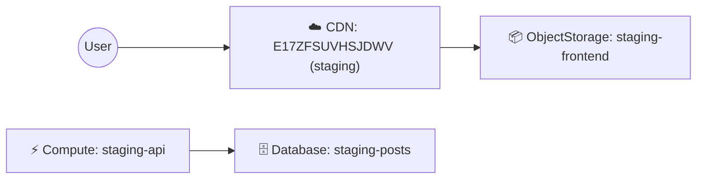

# クラウドアーキテクチャ図へのアイコン追加案

**調査日**: 2026-02-27
**対象**: Mermaid図へのAWS/Azure/GCPサービスアイコン反映

---

## 1. Mermaidでのアイコン表示方法

### 1.1 利用可能な技術

| 方法 | 実現性 | 可搬性 | 実装難易度 |
|------|--------|--------|------------|
| **絵文字** | ✅ 高 | ✅ 高 (どこでも表示可能) | ⭐ 低 |
| **Font Awesome** | ⚠️ 中 (バージョン依存) | ⚠️ 中 (環境依存) | ⭐⭐ 中 |
| **SVG後処理** | ✅ 高 | ⚠️ 低 (カスタムビルド必要) | ⭐⭐⭐ 高 |
| **HTML+CSS** | ✅ 高 | ⚠️ 低 (HTML環境限定) | ⭐⭐⭐ 高 |

### 1.2 推奨アプローチ: **絵文字による視覚的ヒント**

**メリット**:
- VS Code Markdownプレビューで即座に表示
- GitHub, GitLab, Notion などあらゆる環境で動作
- 追加ライブラリ不要
- 実装が簡単（マッピングテーブルのみ）

**デメリット**:
- 公式アイコンではない（視覚的ヒントのみ）
- プラットフォームによって絵文字デザインが異なる

---

## 2. リソースタイプ別絵文字マッピング

### 2.1 AWS サービス

| リソースタイプ | 絵文字 | サービス例 | 説明 |
|----------------|--------|-----------|------|
| `cdn` | ☁️ | CloudFront | Content Delivery Network |
| `compute` | ⚡ | Lambda, EC2 | コンピューティング |
| `object_storage` | 📦 | S3 | オブジェクトストレージ |
| `database` | 🗄️ | DynamoDB, RDS | データベース |
| `api_gateway` | 🔌 | API Gateway | APIゲートウェイ |
| `load_balancer` | ⚖️ | ALB, ELB | ロードバランサー |

### 2.2 Azure サービス

| リソースタイプ | 絵文字 | サービス例 | 説明 |
|----------------|--------|-----------|------|
| `cdn` | 🌐 | Azure CDN, Front Door | CDN |
| `compute` | ⚙️ | Function App, App Service | コンピューティング |
| `object_storage` | 💾 | Blob Storage | ストレージ |
| `database` | 💫 | Cosmos DB, SQL Database | データベース |
| `api_gateway` | 🚪 | API Management | API管理 |

### 2.3 GCP サービス

| リソースタイプ | 絵文字 | サービス例 | 説明 |
|----------------|--------|-----------|------|
| `cdn` | 🚀 | Cloud CDN | CDN |
| `compute` | 🏃 | Cloud Run, Cloud Functions | コンピューティング |
| `object_storage` | 🪣 | Cloud Storage | オブジェクトストレージ |
| `database` | 🔥 | Firestore, Cloud SQL | データベース |
| `load_balancer` | 🔀 | Cloud Load Balancing | ロードバランサー |

### 2.4 統一絵文字（プロバイダー判別が不要な場合）

環境別に色分けしている場合、絵文字をリソースタイプで統一することも可能：

| リソースタイプ | 統一絵文字 | 意味 |
|----------------|-----------|------|
| `cdn` | ☁️ | クラウドCDN |
| `compute` | ⚡ | コンピューティング |
| `object_storage` | 📦 | ストレージ |
| `database` | 🗄️ | データベース |
| `api_gateway` | 🔌 | API |
| `load_balancer` | ⚖️ | 負荷分散 |

---

## 3. 実装案

### 3.1 Option A: シンプルな絵文字追加（推奨）

**変更箇所**: `render_cloud_lines()` 関数

```python
def render_cloud_lines(provider: str, resources: list[dict[str, Any]]) -> list[str]:
    lines = [f"  subgraph {provider.upper()}[{provider.upper()}]"]
    nodes: list[str] = []
    node_index: dict[tuple[str, str], str] = {}

    # アイコンマッピング（統一版）
    icon_mapping = {
        "cdn": "☁️",
        "load_balancer": "⚖️",
        "api_gateway": "🔌",
        "compute": "⚡",
        "database": "🗄️",
        "object_storage": "📦",
    }

    mapping = {
        "cdn": "CDN",
        "load_balancer": "LoadBalancer",
        "api_gateway": "ApiGateway",
        "compute": "Compute",
        "database": "Database",
        "object_storage": "ObjectStorage",
    }

    for resource in resources:
        kind = mapping.get(
            resource.get("resource_type", ""), resource.get("resource_type", "Resource")
        )
        resource_type = resource.get("resource_type", "resource")

        # アイコン取得
        icon = icon_mapping.get(resource_type, "📌")

        rid = normalize_name(
            f"{resource_type}-{resource.get('name')}",
            f"{provider}-{resource_type}-{kind}",
        )
        label = resource.get("name", kind)
        node_index[(resource_type, resource.get("name", ""))] = f"{provider}_{rid}"

        # アイコン付きラベル
        nodes.append(f'    {provider}_{rid}["{icon} {kind}: {label}"]')

    lines.extend(nodes)
    # ... (rest of function)
```

### 3.2 Option B: プロバイダー別アイコン

```python
# プロバイダー別の差別化アイコン
provider_icons = {
    "aws": {
        "cdn": "☁️",
        "compute": "⚡",
        "object_storage": "📦",
        "database": "🗄️",
        "api_gateway": "🔌",
    },
    "azure": {
        "cdn": "🌐",
        "compute": "⚙️",
        "object_storage": "💾",
        "database": "💫",
    },
    "gcp": {
        "cdn": "🚀",
        "compute": "🏃",
        "object_storage": "🪣",
        "database": "🔥",
        "load_balancer": "🔀",
    },
}

icon = provider_icons.get(provider, {}).get(resource_type, "📌")
```

### 3.3 Option C: 設定ファイルでカスタマイズ可能

`icon_config.json`:
```json
{
  "unified": {
    "cdn": "☁️",
    "compute": "⚡",
    "object_storage": "📦",
    "database": "🗄️"
  },
  "aws": {
    "cdn": "☁️ AWS",
    "compute": "λ "
  },
  "azure": {
    "cdn": "🌐",
    "compute": "⚙️"
  },
  "gcp": {
    "cdn": "🚀",
    "compute": "🏃",
    "database": "🔥"
  }
}
```

---

## 4. 将来的な拡張: 公式アイコンの統合

### 4.1 公式アイコンリソース

各クラウドプロバイダーは公式アイコンを提供：

- **AWS**: [AWS Architecture Icons](https://aws.amazon.com/architecture/icons/)
  - SVG/PNG形式でダウンロード可能
  - 各サービスごとに専用アイコン

- **Azure**: [Azure Architecture Icons](https://docs.microsoft.com/en-us/azure/architecture/icons/)
  - SVG形式で提供
  - Icon Browserツールあり

- **GCP**: [Google Cloud Icons](https://cloud.google.com/icons)
  - SVG/PNG形式
  - カラー/モノクロ両対応

### 4.2 実装方法（高度）

**ステップ1**: アイコンSVGのダウンロード
```bash
# 各クラウドの公式アイコンをダウンロード
mkdir -p assets/icons/{aws,azure,gcp}
# 手動またはスクリプトでダウンロード
```

**ステップ2**: SVG後処理スクリプト
```python
import xml.etree.ElementTree as ET

def embed_icons_in_mermaid_svg(mermaid_svg: str, icon_mapping: dict) -> str:
    """MermaidでレンダリングされたSVGに公式アイコンを埋め込む"""
    tree = ET.fromstring(mermaid_svg)

    # 各ノードを検索してアイコン画像を挿入
    for node in tree.findall(".//{http://www.w3.org/2000/svg}g[@class='node']"):
        # ノードIDからリソースタイプを判定
        # 対応するアイコンSVGを<image>要素として挿入
        pass

    return ET.tostring(tree, encoding='unicode')
```

**ステップ3**: レンダリングパイプライン
```bash
# Mermaid CLI でSVG生成
mmdc -i architecture.mmd -o architecture_base.svg

# Pythonスクリプトでアイコン埋め込み
python embed_icons.py architecture_base.svg architecture_final.svg
```

---

## 5. 実装の優先順位

### フェーズ1（即座に実装可能）: 絵文字アイコン ⭐ 推奨
- シンプルで移植性が高い
- 実装工数: **1時間**
- メリット: VS Codeプレビュー、GitHub等で即座に反映

### フェーズ2（中期的）: Font Awesomeアイコン
- Mermaid Liveなど一部環境で動作
- 実装工数: **2-3時間**
- 検証が必要（環境依存性）

### フェーズ3（長期的）: 公式アイコンSVG埋め込み
- 最も視覚的に正確
- 実装工数: **1-2日**
- レンダリングパイプラインが複雑化

---

## 6. 推奨実装（フェーズ1）

最もバランスの良い「統一絵文字マッピング」をすぐに実装することを推奨します。

**実装内容**:
1. `cloud_architecture_mapper.py` に絵文字マッピングを追加
2. `render_cloud_lines()` でアイコン付きラベルを生成
3. `render_overlay()` でも同様の対応

**期待される結果**:


実装しますか？それとも別のアプローチを希望されますか？
