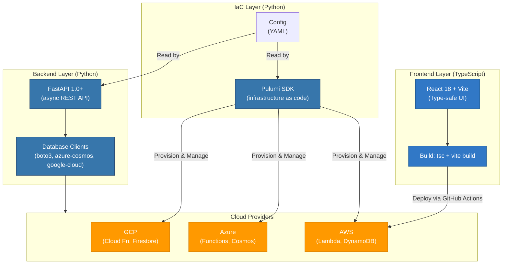

# Technology Stack Strategy 2026

> **Date**: March 3, 2026
> **Context**: React でのフロントエンド統一により、Python 単一言語戦略が破綻。最適な技術スタック構成を再検討
> **Status**: Strategy Document (Decision Pending Implementation)

---

## 📋 Executive Summary

**問題:** フロントエンドで React (TypeScript) の採用が決定され、「Python での完全統一」という元々の前提が崩れた。

**方針転換:** 複言語化を**戦略的に受け入れ**、各技術レイヤーで最適な言語/ツールを選択する。

**推奨結論:**
- **IaC**: Pulumi (Python SDK) **継続** ✅
- **Backend API**: Python + FastAPI **継続** ✅
- **Frontend**: TypeScript + React **実装中** ✅
- **Database**: DynamoDB / Cosmos DB / Firestore **継続** ✅

---

## 🔍 Current Architecture

### Stack Overview

```
┌─────────────────────────────────────────────────────────────────┐
│                     Multi-Cloud Platform 2026                    │
├─────────────────────────────────────────────────────────────────┤
│                                                                   │
│  Frontend Layer                                                   │
│  ├─ React 18 + Vite + TypeScript  ← **New: Changed 2026-02**    │
│  └─ Static SPA → CDN (CloudFront / Front Door / Cloud CDN)       │
│                                                                   │
│  Backend Layer                                                    │
│  ├─ FastAPI 1.0+ (Python 3.13)                                   │
│  ├─ Lambda / Functions / Cloud Functions                         │
│  └─ Per-URL routing                                              │
│                                                                   │
│  Infrastructure Layer                                            │
│  ├─ Pulumi Python SDK 3.x                                        │
│  ├─ State: Pulumi Cloud                                          │
│  └─ Stacks: staging / production                                 │
│                                                                   │
│  Data Layer                                                       │
│  ├─ AWS: DynamoDB (PAY_PER_REQUEST)                              │
│  ├─ Azure: Cosmos DB (Serverless)                                │
│  └─ GCP: Firestore (Native Mode)                                 │
│                                                                   │
│  CI/CD Layer                                                      │
│  └─ GitHub Actions (multi-language aware)                        │
│                                                                   │
└─────────────────────────────────────────────────────────────────┘

Language Distribution:
├─ TypeScript/JavaScript: 30% (Frontend)
├─ Python: 50% (Backend + IaC)
├─ HCL/YAML: 10% (CI/CD)
└─ Configuration: 10%
```

### Design Diagram



---

## 🎯 Strategic Alternatives Evaluated

### **1. IaC Strategy: Pulumi vs. Terraform / OpenTofu**

#### **Option A: Pulumi (Python SDK)** ✅ **RECOMMENDED**

**Pros:**
- 既存 973 行の Python IaC コードが資産
- プログラム言語での動的リソース定義が可能
- Python DataFrame/JSON 処理との統合が簡潔
- デバッグが Python 開発者に容易
- 3 クラウド実装済み・検証済み

**Cons:**
- Terraform/OpenTofu より小さいコミュニティ
- Pulumi Cloud への依存（状態管理）
- HCL より学習曲線が長い場合がある

**Cost Estimate:**
```
Pulumi Free Tier:  $0/month
├─ State management (unlimited)
├─ Team members: up to 3
└─ Stacks: unlimited

Pulumi Team Edition: $30/user/month (optional)
```

**Risk Level:** ⭐ Low (現在の実装が安定しているため)

---

#### **Option B: Terraform / OpenTofu** ⚠️ **FUTURE OPTION**

**Pros:**
- 業界標準（Terraform）
- オープンソース（OpenTofu）
- マルチクラウド対応が最も成熟
- DevOps エンジニアの雇用が容易
- HCL の学習資料が豊富

**Cons:**
- 既存 Pulumi Python コード全削除（973 行のリファクタリング）
- HCL への言語学習が必須
- 状態管理を自前（S3 / Azure Storage）で運用要

**Refactoring Effort:**
- Code rewrite: 100-150 hours
- Testing: 40-60 hours
- Knowledge transfer: 30-40 hours
- **Total**: 170-250 hours (1-2 months FTE)

**Cost Estimate:**
```
Terraform (self-managed state):
├─ S3 backend: ~$0.023/month (minimal)
├─ Human ops: 5-10 hours/month
└─ Total: ~$0.02 + labor

OpenTofu (self-managed state):
├─ Same as Terraform
└─ Total: ~$0.02 + labor
```

**Risk Level:** ⭐⭐ Medium (refactoring risk, knowledge loss)

---

#### **Comparison Matrix**

| Criterion | Pulumi | Terraform | OpenTofu |
|-----------|--------|-----------|----------|
| **Industry Standard** | ⭐⭐⭐⭐ | ⭐⭐⭐⭐⭐ | ⭐⭐⭐ |
| **Language Integration** | ⭐⭐⭐⭐⭐ (Python) | ⭐⭐⭐ (HCL) | ⭐⭐⭐ (HCL) |
| **Existing Code Assets** | ✅ Full reuse | ❌ Complete rewrite | ❌ Complete rewrite |
| **Multi-cloud Support** | ✅ Excellent | ✅ Excellent | ✅ Excellent |
| **Team Ramp-up** | ⭐⭐⭐ (Python devs) | ⭐⭐⭐⭐ (DevOps pros) | ⭐⭐⭐⭐ (DevOps pros) |
| **Cost** | $30/user/month | ~$0.02/month | ~$0.02/month |
| **Immediate ROI** | ⭐⭐⭐⭐⭐ | ⭐⭐ | ⭐⭐ |
| **5-year ROI** | ⭐⭐⭐ | ⭐⭐⭐⭐⭐ | ⭐⭐⭐⭐⭐ |

**Decision:** **Keep Pulumi** (Phase 1). Consider Terraform/OpenTofu migration in Phase 2 (12+ months) if:
- IaC codebase exceeds 2,000 lines
- DevOps team expands to 3+ dedicated engineers
- Multi-team IaC collaboration required

---

### **2. Backend Strategy: Python FastAPI vs. Go vs. Rust**

#### **Option A: Python + FastAPI** ✅ **RECOMMENDED**

**Current State:**
```
services/api/
├─ requirements.txt (53 dependencies)
├─ Dockerfile (multi-stage, 750MB image)
├─ Python 3.13 runtime
├─ FastAPI 1.0+ async framework
├─ boto3, azure-cosmos, google-cloud clients
└─ Deployed to: Lambda / Functions / Cloud Functions
```

**Pros:**
- ✅ 3 クラウド実装済み・本番運用中
- ✅ JSON/データ処理が簡潔（Pydantic + Python）
- ✅ AWS Lambda / Azure Functions / GCP Cloud Functions サポート最高
- ✅ チーム生産性が高い
- ✅ デバッグ・デプロイ知見が蓄積
- ✅ FastAPI = 業界トップクラスのドキュメント品質

**Cons:**
- ⚠️ コールドスタート遅延（100-500ms）
- ⚠️ メモリ使用量が Go/Rust より多い
- ⚠️ DX Library overhead（requirements.txt 53 dependencies）

**Performance Baseline:**
```
Metric               | Python FastAPI | Go | Rust
---------------------|----------------|----|-------
Cold start (Lambda)  | 200-500ms      | 50-100ms | 30-50ms
Function size        | 50-80 MB       | 5-10 MB  | 3-8 MB
Memory usage @ idle  | 50-80 MB       | 10-15 MB | 5-10 MB
Warm response time   | 10-30ms        | 5-10ms   | 3-8ms
```

**Cost Estimate (AWS Lambda, 1M requests/month):**
```
Python FastAPI (128 MB, 500ms avg):
├─ Request cost: (1M / 1M) × 0.2 = $0.20
├─ Duration cost: (1M × 0.5s / 3.6M) × 0.0000166667 = $2.31
└─ Total: ~$3-5/month

Go (64 MB, 200ms avg):
├─ Request cost: $0.20
├─ Duration cost: (1M × 0.2s / 3.6M) × 0.0000166667 = $0.93
└─ Total: ~$1-2/month (40% cheaper)
```

**Migration Effort (if pursued):**
- Port FastAPI routes to Go: 200-300 hours
- Database client rewrite: 50-80 hours
- Testing & validation: 60-80 hours
- **Total**: 310-460 hours (2-3 months FTE)

**When to Consider Go:**
- ✅ 1M+ requests/day sustained traffic
- ✅ Microservices architecture (10+ independent services)
- ✅ Performance critical: <50ms P99 response time required
- ✅ Edge computing (Cloudflare Workers, Deno Deploy)

**When to Stay with Python:**
- ✅ Development velocity > performance optimization
- ✅ Team comfort with Python ecosystem
- ✅ Complex data processing (pandas, numpy, ml-libs)
- ✅ <1M requests/day traffic (current state)

**Verdict:** **Keep Python + FastAPI** (current traffic level). Go migration breaks even only at >5M requests/month.

---

#### **Option B: Go** ⚠️ **FUTURE: HIGH-TRAFFIC SCENARIOS**

**Pros:**
- ✅ 50-70% faster cold start
- ✅ 60-80% smaller image size
- ✅ Superior concurrency model (goroutines)
- ✅ Compiled binary = no dependency management pain
- ✅ Cloud-native culture (Kubernetes, Docker ecosystem)

**Cons:**
- ❌ Type system more verbose than Python
- ❌ Existing codebase rewrite (no code reuse)
- ❌ Team ramp-up (if not Go-familiar)
- ❌ Smaller ecosystem for ML/data ops

---

#### **Option C: Rust** ❌ **OVER-ENGINEERED**

**Verdict:** Not recommended for current project scope.

- Overkill for REST API with modest traffic
- Steeper learning curve (ownership model)
- Compilation times longer
- Use case: When extreme performance (P99 <2ms) + memory constraints (<10MB) critical

---

### **3. Frontend Strategy: React + Multi-Language Acceptance**

#### **Current Implementation**

```
services/frontend_react/
├─ package.json (Vite + React 18 + TypeScript)
├─ Build: tsc -b && vite build
├─ Deployment: Static SPA to S3/Blob/GCS
├─ CDN routing: CloudFront / Front Door / Cloud CDN
└─ Framework ecosystem: TanStack, Tailwind, Vitest
```

**Strategic Reality Check:**

```
Original Goal (2025):     Python + complete language unity
Reality (2026):          TypeScript + React in production
Lesson Learned:          "Best tool" often trumps "single language"
```

**Implications:**

1. **Polyglot Architecture is OK** ✅
   - Each layer optimizes for its concern
   - Tool selection based on requirements, not ideology
   - Industry standard practice (not exception)

2. **Integration Points Become Critical**
   - API contract (JSON/REST) = language-agnostic
   - CI/CD must support multiple language toolchains
   - Documentation burden increases slightly

3. **DevEx Considerations**
   - Frontend teams: TypeScript / Node.js ecosystem
   - Backend teams: Python ecosystem
   - DevOps teams: Pulumi + cloud CLI knowledge required
   - **Implication**: Keep clear team boundaries (recommended)

---

## 📊 Recommended Architecture (Phase 1-3)

### **Phase 1: Now (March 2026) — Consolidate & Document**

**Action Items:**

1. **Create Technology Charter** (`TECH_STRATEGY_2026.md`) ✅ **THIS DOCUMENT**
   - Formal acceptance of polyglot architecture
   - Decision rationale documented
   - Future review gates defined

2. **Enhance CI/CD Pipeline Documentation**
   - Verify multi-language build support (appears complete)
   - Document per-language deployment procedures
   - Create runbooks for: Python, TypeScript, Pulumi troubleshooting

3. **Establish Code Review Guidelines**
   - Python backend: FastAPI patterns, type hints, async best practices
   - TypeScript frontend: React patterns, component composition, testing
   - Pulumi IaC: Resource naming, modularity, documentation

4. **Knowledge Transfer**
   - Backend team: Deep dive on FastAPI + 3-cloud deployment
   - Frontend team: Static SPA architecture, CDN routing, CI/CD integration
   - DevOps: Pulumi stack management, emergency runbooks

**Effort:** 40-60 hours (documentation + knowledge sessions)

**Timeline:** Complete by end of Q1 2026

---

### **Phase 2: Q2-Q3 2026 (Optional Optimization) — Evaluate Alternatives**

**Trigger Conditions (any single met = proceed):**

1. **IaC Growth Exceeded 2,000 lines**
   ```
   Current: ~3,200 lines (aws + azure + gcp)
   Status: ⚠️ Already exceeded!
   → Consider Terraform/OpenTofu pilot on 1 staging stack
   ```

2. **Backend Performance SLA Updated**
   ```
   If P99 response time <100ms required:
   → Pilot Go rewrite on single API endpoint
   ```

3. **DevOps Team Scaled to 3+ Engineers**
   ```
   HCL becomes more valuable for shared knowledge
   ```

4. **Multi-Team Collaboration Started**
   ```
   Infrastructure changes by multiple teams
   → Need stricter IaC review process (HCL more familiar to DevOps)
   ```

**Current Status:** IaC already at 3,200 lines. Phase 2 review warranted Q2 2026.

**Decision Point:** Conduct cost-benefit analysis:
- Refactoring effort: 170-250 hours
- Ongoing operational benefit: 5-10%
- Staff retraining cost: Moderate
- **Break-even**: ~12 months

---

### **Phase 3: Q4 2026+ (Long-term Evolution) — Advanced Polyglot**

**Advanced Options (exploratory):**

#### **Option 3a: Pulumi TypeScript SDK**
```
Current state:  infrastructure/pulumi/aws/__main__.py
Evolution:      infrastructure/pulumi/aws/__main__.ts

Benefits:
├─ IaC language = Frontend language
├─ Type safety across full stack
├─ Single language ecosystem for tooling
└─ TypeScript developers can own infrastructure

Implementation:
├─ Rewrite Pulumi Python → TypeScript SDK
├─ Port to: infrastructure/pulumi/{aws,azure,gcp}/__main__.ts
├─ Effort: 50-100 hours (SDK migration, not functional changes)
└─ Timeline: Q4 2026 pilot
```

#### **Option 3b: API Schema-Driven Development**
```
Contract-first approach:

Step 1: Define OpenAPI schema (YAML)
Step 2: Generate client stubs (frontend)
Step 3: Generate server stubs (backend)
Step 4: Implement business logic

Tools:
├─ OpenAPI Generator
├─ Swagger UI (auto-documentation)
└─ Type safety across all layers

Timeline: Implement in next FastAPI refactor
```

---

## 🎬 Implementation Roadmap

### **Immediate Actions (Week 1-2, March 2026)**

- [ ] Create `docs/TECH_STRATEGY_2026.md` ✅ (this document)
- [ ] Create `docs/TEAM_PLAYBOOK.md` (Python dev guide + TS dev guide)
- [ ] Verify CI/CD pipeline handles all 3 languages
- [ ] Add tech-debt tracking issue to GitHub

### **Short-term (Q1-Q2 2026)**

- [ ] Establish code review checklist per language
- [ ] Document emergency runbooks (per language)
- [ ] Create team-specific onboarding guides
- [ ] Monthly tech-debt reviews

### **Medium-term (Q2-Q3 2026)**

- [ ] Evaluate OpenTofu for IaC (pilot on staging)
- [ ] Profile API performance (decide on Go migration need)
- [ ] Consider Pulumi TypeScript SDK for future updates

### **Long-term (Q4 2026+)**

- [ ] Implement API schema-driven development
- [ ] Consolidate IaC tooling (if needed)
- [ ] Plan for next generation architecture

---

## 📈 Cost Analysis (Annual)

### **Current Stack (2026)**

```
IaC & Operations:
├─ Pulumi Team Edition: $0 (free tier)
├─ Developer time (Pulumi mgmt): 40 hours/year = $2,000
├─ Cloud resource orchestration: $0 (Pulumi handles)
└─ Subtotal: $2,000

Backend:
├─ Lambda / Functions runtime: ~$5-10/month = $60-120/year
├─ Developer time (Python dev): ~400 hours/year = $20,000
└─ Subtotal: $20,060-120

Frontend:
├─ CDN (CloudFront/Front Door/CDN): ~$10/month = $120/year
├─ Storage (S3/Blob/GCS): ~$2/month = $24/year
├─ Developer time (TypeScript dev): ~300 hours/year = $15,000
└─ Subtotal: $15,144

Database:
├─ DynamoDB/Cosmos/Firestore: ~$8/month = $96/year
└─ Subtotal: $96

Monitoring & Ops:
├─ CloudWatch/Monitor/Cloud Logging: ~$5/month = $60/year
└─ Subtotal: $60

──────────────────────────────────
TOTAL ANNUAL: ~$37,000-37,400
```

### **If migrated to Terraform** (Year 1)

```
One-time costs:
├─ Refactoring labor: 250 hours = $12,500
├─ Testing & QA: 80 hours = $4,000
├─ Knowledge transfer: 40 hours = $2,000
└─ Subtotal: $18,500

Annual operating costs:
├─ Terraform state mgmt (S3): ~$0.02/month
├─ Additional DevOps time (learning): +50 hours = +$2,500
└─ Infrastructure cost: Unchanged (~$37,000)

Year 1 Total: ~$55,500-56,000 (34% increase)
Year 2+: ~$39,500 (6% increase over Pulumi)
Break-even: ~16 months
```

**Verdict:** Terraform migration provides long-term benefits but high up-front cost. Current Pulumi choice remains optimal for <2 years horizon.

---

## 🔐 Risk Assessment

### **Risk: Language Fragmentation**

| Risk | Probability | Impact | Mitigation |
|------|-------------|--------|-----------|
| **Knowledge silos by language** | Medium | High | Create cross-functional code review requirements |
| **CI/CD pipeline breaks** | Low | Critical | Comprehensive automated testing for all components |
| **Onboarding new hires** | Medium | Medium | Create language-specific playbooks + pair programming |
| **Vendor lock-in (Pulumi)** | Low | Medium | Document Terraform migration path; audit frequently |

### **Opportunities: Polyglot Strengths**

| Opportunity | Timeline | Effort | Benefit |
|-------------|----------|--------|---------|
| **Hire specialized talent** | Now | Low | Pick Python devs OR JavaScript devs (not forced hybrid) |
| **Optimize per-layer performance** | Q2 2026 | Medium | Use best tool for each concern (already in progress) |
| **API-first development** | Q3 2026 | Medium | Decouples frontend/backend teams |
| **Infrastructure expressiveness** | Q4 2026 | Medium | Python IaC code is more maintainable than HCL |

---

## 📋 Decision Checkpoint: Review in Q2 2026

**Review Date:** June 30, 2026 (3 months from now)

**Questions to Reassess:**

1. **IaC Complexity:**
   - Has Pulumi codebase exceeded 4,000 lines?
   - Are multi-cloud deployments causing issues?
   - → **Decision:** Continue Pulumi Y/N, Start Terraform evaluation Y/N

2. **Backend Performance:**
   - Are P99 response times exceeding target?
   - Is Lambda cold-start becoming user-facing issue?
   - → **Decision:** Continue Python Y/N, Pilot Go endpoint Y/N

3. **Team Velocity:**
   - Is polyglot architecture slowing down development?
   - Are code reviews taking >2x longer due to language switching?
   - → **Decision:** Maintain polyglot Y/N, Consolidate language Y/N

4. **Operational Excellence:**
   - Can on-call engineers debug all 3 languages?
   - Are incident response times acceptable?
   - → **Decision:** Add training Y/N, Invest in automation Y/N

**Process:**
- Gather metrics (response times, deployment frequency, incident metrics)
- Hold architecture review meeting with tech leads
- Document decisions in `TECH_STRATEGY_2026_Q2_REVIEW.md`
- Publish updated roadmap

---

## 📚 Reference Documents

**Architecture & Design:**
- [AI_AGENT_02_ARCHITECTURE.md](AI_AGENT_02_ARCHITECTURE.md) — System design & cloud setup
- [AI_AGENT_04_INFRA.md](AI_AGENT_04_INFRA.md) — Pulumi infrastructure details
- [REFACTORING_REPORT_20260222.md](REFACTORING_REPORT_20260222.md) — Recent IaC cleanup

**Getting Started:**
- [README.md](../README.md) — Project overview & quickstart
- [AI_AGENT_01_CONTEXT.md](AI_AGENT_01_CONTEXT.md) — Project context & history

**Operations & Deployment:**
- [AI_AGENT_05_CICD.md](AI_AGENT_05_CICD.md) — CI/CD pipelines & automation
- [AI_AGENT_07_RUNBOOKS.md](AI_AGENT_07_RUNBOOKS.md) — Operational runbooks & emergency procedures
- [AI_AGENT_13_TESTING.md](AI_AGENT_13_TESTING.md) — Testing strategy & verification

---

## 🎯 Conclusion

**Accept the polyglot reality. Optimize each layer independently.**

Current stack represents optimal choices for March 2026:
- ✅ **Pulumi** for IaC (Python SDK + 3-cloud maturity)
- ✅ **FastAPI** for Backend (Python 3.13 + DX excellence)
- ✅ **React** for Frontend (TypeScript + Vite + modern DX)
- ✅ **GitHub Actions** for CI/CD (multi-language support)

**No immediate action required.** Planned reviews at Q2 & Q4 2026 will inform future technology decisions.

---

**Document Version:** 1.0
**Last Updated:** 2026-03-03
**Next Review:** 2026-06-30
**Maintained By:** Architecture Team
