# Local Development Guide

> **AI Agent Note**: Documents the local development environment for `multicloud-auto-deploy/services/api/`.
> The local backend uses **DynamoDB Local + MinIO** — the same NoSQL data model as the cloud backends.

---

## Overview

The local environment is designed to mirror cloud architecture as closely as possible:

| Environment | Database                   | Object Storage    | API                         |
| ----------- | -------------------------- | ----------------- | --------------------------- |
| **Local**   | DynamoDB Local (port 8001) | MinIO (port 9000) | FastAPI uvicorn (port 8000) |
| **AWS**     | DynamoDB                   | S3                | Lambda + API Gateway        |
| **GCP**     | Firestore                  | Cloud Storage     | Cloud Run                   |
| **Azure**   | Cosmos DB                  | Blob Storage      | Azure Functions             |

All environments share the **same NoSQL document model** and the same `BackendBase` interface.

---

## Architecture

```mermaid
graph TD
    Dev([開発者 / ブラウザ])

    subgraph Docker_Compose["docker compose up"]
        API["🐍 api\nFastAPI / uvicorn\nport 8000\nCLOUD_PROVIDER=local"]
        DDB["🗄️ dynamodb-local\namazon/dynamodb-local\nport 8001\nTable: simple-sns-local"]
        MINIO["🪣 minio\nminio/minio\nport 9000 (API)\nport 9001 (Console)\nBucket: simple-sns"]
    end

    Dev -->|"HTTP :8000\n/api/*"| API
    Dev -->|"Console :9001"| MINIO
    API -->|"DynamoDB SDK\nhttp://dynamodb-local:8001"| DDB
    API -->|"S3-compatible SDK\nhttp://minio:9000"| MINIO
```



```
docker-compose up
│
├── api  (FastAPI, port 8000)
│     CLOUD_PROVIDER=local
│     DYNAMODB_ENDPOINT=http://dynamodb-local:8001
│     MINIO_ENDPOINT=http://minio:9000
│
├── dynamodb-local  (amazon/dynamodb-local, port 8001)
│     Single table: simple-sns-local
│     Persistent: dynamodb-data volume
│
└── minio  (minio/minio, port 9000 / console 9001)
      Bucket: simple-sns
      Persistent: minio-data volume
```

---

## Data Model (DynamoDB Single-Table Design)

The local backend uses the **same table schema** as the cloud AWS backend.

### Table: `simple-sns-local`

```mermaid
erDiagram
    POST {
        string PK "POSTS (固定)"
        string SK "ISO-timestamp#uuid"
        string postId "GSI hash key"
        string userId
        string content
        string tags
        string createdAt
    }
    PROFILE {
        string PK "USER#userId"
        string SK "PROFILE (固定)"
        string postId "PROFILE#userId (GSI)"
        string userId
        string nickname
        string bio
    }
    GSI_PostIdIndex {
        string postId "Hash key (ALL projection)"
    }
    POST ||--o{ GSI_PostIdIndex : "postId →"
    PROFILE ||--o{ GSI_PostIdIndex : "postId = PROFILE#userId →"
```

| Item type | PK              | SK                       | Key attributes                                                 |
| --------- | --------------- | ------------------------ | -------------------------------------------------------------- |
| Post      | `POSTS`         | `<ISO timestamp>#<uuid>` | `postId` (GSI), `userId`, `content`, `tags`, `createdAt`       |
| Profile   | `USER#<userId>` | `PROFILE`                | `postId = PROFILE#<userId>` (GSI), `userId`, `nickname`, `bio` |

### GSI: `PostIdIndex`

| Key        | Value    |
| ---------- | -------- |
| Hash key   | `postId` |
| Projection | ALL      |

This GSI enables point lookups by post ID and profile lookups by `PROFILE#<userId>`.

---

## Setup

### Prerequisites

- Docker & Docker Compose
- Python 3.13+

### Start All Services

```bash
cd multicloud-auto-deploy
docker compose up
```

| Service        | URL                          | Notes                       |
| -------------- | ---------------------------- | --------------------------- |
| FastAPI        | http://localhost:8000        | API endpoints               |
| FastAPI docs   | http://localhost:8000/docs   | Swagger UI                  |
| DynamoDB Local | http://localhost:8001/shell/ | Web shell                   |
| MinIO Console  | http://localhost:9001        | `minioadmin` / `minioadmin` |

### Start API Only (without Docker, for development)

```bash
cd multicloud-auto-deploy/services/api
pip install -r requirements.txt

# Start DynamoDB Local separately first, then:
export CLOUD_PROVIDER=local
export DYNAMODB_ENDPOINT=http://localhost:8001
export DYNAMODB_TABLE_NAME=simple-sns-local
export MINIO_ENDPOINT=http://localhost:9000
export MINIO_ACCESS_KEY=minioadmin
export MINIO_SECRET_KEY=minioadmin
export MINIO_BUCKET_NAME=simple-sns
export AUTH_DISABLED=true

uvicorn app.main:app --reload --port 8000
```

---

## Environment Variables

### `services/api` — Local Provider

| Variable                | Default                 | Description                                    |
| ----------------------- | ----------------------- | ---------------------------------------------- |
| `CLOUD_PROVIDER`        | `local`                 | Selects `LocalBackend`                         |
| `DYNAMODB_ENDPOINT`     | `http://localhost:8001` | DynamoDB Local endpoint                        |
| `DYNAMODB_TABLE_NAME`   | `simple-sns-local`      | Table name                                     |
| `AWS_ACCESS_KEY_ID`     | `local`                 | Dummy (DynamoDB Local accepts any value)       |
| `AWS_SECRET_ACCESS_KEY` | `local`                 | Dummy                                          |
| `AWS_DEFAULT_REGION`    | `ap-northeast-1`        | Region label                                   |
| `MINIO_ENDPOINT`        | _(none)_                | If unset, uses local filesystem URLs           |
| `MINIO_ACCESS_KEY`      | `minioadmin`            | MinIO root user                                |
| `MINIO_SECRET_KEY`      | `minioadmin`            | MinIO root password                            |
| `MINIO_BUCKET_NAME`     | `simple-sns`            | Bucket for image uploads                       |
| `AUTH_DISABLED`         | `false`                 | Set `true` to skip JWT validation in local dev |
| `STORAGE_PATH`          | `./storage`             | Local filesystem fallback path                 |

---

## DynamoDB Local Operations

### Inspect the table

```bash
# List tables
aws dynamodb list-tables \
  --endpoint-url http://localhost:8001 \
  --region ap-northeast-1

# Scan all items
aws dynamodb scan \
  --table-name simple-sns-local \
  --endpoint-url http://localhost:8001 \
  --region ap-northeast-1

# Query posts (PK = POSTS)
aws dynamodb query \
  --table-name simple-sns-local \
  --key-condition-expression "PK = :pk" \
  --expression-attribute-values '{":pk":{"S":"POSTS"}}' \
  --endpoint-url http://localhost:8001 \
  --region ap-northeast-1

# Get a specific post by postId (GSI)
aws dynamodb query \
  --table-name simple-sns-local \
  --index-name PostIdIndex \
  --key-condition-expression "postId = :pid" \
  --expression-attribute-values '{":pid":{"S":"<paste-post-id>"}}' \
  --endpoint-url http://localhost:8001 \
  --region ap-northeast-1

# Get a user profile (GSI)
aws dynamodb query \
  --table-name simple-sns-local \
  --index-name PostIdIndex \
  --key-condition-expression "postId = :pid" \
  --expression-attribute-values '{":pid":{"S":"PROFILE#<user-id>"}}' \
  --endpoint-url http://localhost:8001 \
  --region ap-northeast-1
```

### Reset the table

```bash
# Delete the table (it is auto-recreated on next API startup)
aws dynamodb delete-table \
  --table-name simple-sns-local \
  --endpoint-url http://localhost:8001 \
  --region ap-northeast-1
```

---

## MinIO Operations

```bash
# Open the web console
open http://localhost:9001
# Login: minioadmin / minioadmin

# List objects via CLI (requires mc)
mc alias set local http://localhost:9000 minioadmin minioadmin
mc ls local/simple-sns
```

---

## Running Tests

Tests use **in-memory mocks** for all three cloud backends and do **not** require DynamoDB Local or MinIO to be running.

```bash
cd multicloud-auto-deploy/services/api

# Run all local tests (mocks only)
python -m pytest tests/ -q
# Expected: 46 passed, 21 deselected

# Run per-backend
python -m pytest tests/test_backends_integration.py::TestAwsBackend -v
python -m pytest tests/test_backends_integration.py::TestGcpBackend -v
python -m pytest tests/test_backends_integration.py::TestAzureBackend -v

# Run live cloud endpoint tests (requires deployed services)
export AWS_API_ENDPOINT="https://z42qmqdqac.execute-api.ap-northeast-1.amazonaws.com"
python -m pytest tests/ -m requires_network -v
```

---

## Backend Implementation

### `LocalBackend` (`app/backends/local_backend.py`)

The local backend is implemented with:

- **Database**: `boto3` → DynamoDB Local via `endpoint_url`
- **Storage**: MinIO SDK (`minio` package) for presigned upload URLs
- **Table creation**: `_ensure_table()` auto-creates the table with `PostIdIndex` GSI on first startup
- **Data model**: Identical to `AwsBackend` — the same `PK/SK` scheme, same `PostIdIndex` GSI, same item attributes

```python
# DynamoDB Local client — auto-configured in local_backend.py
boto3.resource(
    "dynamodb",
    endpoint_url=settings.dynamodb_endpoint,   # http://dynamodb-local:8001
    aws_access_key_id="local",                 # dummy, DynamoDB Local accepts any
    aws_secret_access_key="local",
)
```

### Backend Factory (`app/backends/__init__.py`)

```python
CLOUD_PROVIDER=local   -> LocalBackend  (DynamoDB Local + MinIO)
CLOUD_PROVIDER=aws     -> AwsBackend    (DynamoDB + S3)
CLOUD_PROVIDER=gcp     -> GcpBackend    (Firestore + Cloud Storage)
CLOUD_PROVIDER=azure   -> AzureBackend  (Cosmos DB + Blob Storage)
```

---

## Why DynamoDB Local Instead of PostgreSQL

The previous local backend used SQLAlchemy + PostgreSQL/SQLite, which diverged from the cloud data model:

| Aspect            | Old (SQLAlchemy)                | New (DynamoDB Local)               |
| ----------------- | ------------------------------- | ---------------------------------- |
| Data model        | Relational tables               | Document items (same as cloud)     |
| Key design        | Auto-increment IDs              | Single-table `PK/SK` + GSI         |
| Array fields      | SQLite: JSON string / PG: ARRAY | Native DynamoDB List               |
| Query pattern     | SQL JOIN for profile+post       | DynamoDB Query by GSI              |
| Dependency        | `psycopg2-binary`, `sqlalchemy` | `boto3` (already required for AWS) |
| Local infra       | PostgreSQL container            | DynamoDB Local container           |
| Parity with cloud | Low (different engine)          | High (same API surface)            |

By using DynamoDB Local, a bug found and fixed locally is very likely to behave identically in the cloud AWS environment.

---

## Troubleshooting

### DynamoDB Local not starting

```bash
# Check health
curl http://localhost:8001/shell/

# Check logs
docker compose logs dynamodb-local

# Restart
docker compose restart dynamodb-local
```

### Table not found error

The table is created automatically when the API first connects. If the error persists:

```bash
# Verify the endpoint is reachable
aws dynamodb list-tables \
  --endpoint-url http://localhost:8001 \
  --region ap-northeast-1

# Check API logs
docker compose logs api
```

### MinIO not available

MinIO is optional for local development. If it is not reachable, the API falls back to local filesystem URLs (`http://localhost:8000/storage/<key>`). Image upload URLs will not be presigned but the API remains functional.

### AWS credential errors with DynamoDB Local

DynamoDB Local ignores actual AWS credentials. Set any non-empty values:

```bash
export AWS_ACCESS_KEY_ID=local
export AWS_SECRET_ACCESS_KEY=local
export AWS_DEFAULT_REGION=ap-northeast-1
```

---

## Related Documents

- [ARCHITECTURE.md](ARCHITECTURE.md) — full system architecture including cloud resources
- [SETUP.md](SETUP.md) — project setup and cloud deployment
- [TEST_EXECUTION_REPORT.md](TEST_EXECUTION_REPORT.md) — test results and refactoring log
- [INTEGRATION_TESTS_GUIDE.md](INTEGRATION_TESTS_GUIDE.md) — integration test guide
